Desarrolo de ejercicios practicos del TP1.

## 1 Instalar git
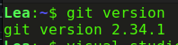

## 2 Creamos un repositorio local y agregamos archivos
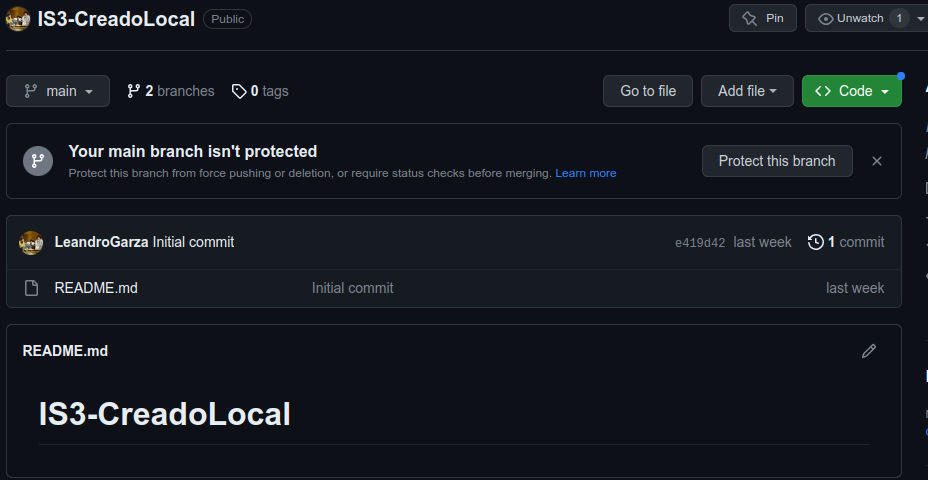

## 3 configuracion del editor predeterminado
En mi caso que tengo ubuntu suelo usar visual studio, aunque tambien tengo sublime text
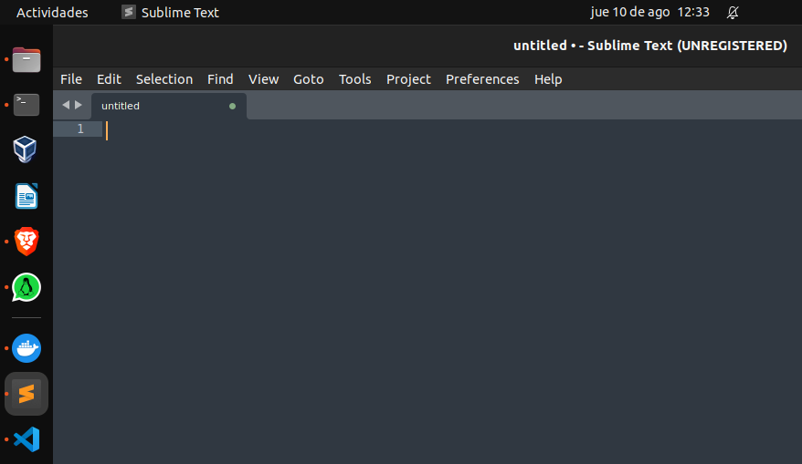

## 4 y 5 creacion de repos local y remoto 
Tanto en la imagen 4 como en la 2 creamos un repo local y otro remoto. Cada uno con sus archivos readme y .gitignore como se menciona.
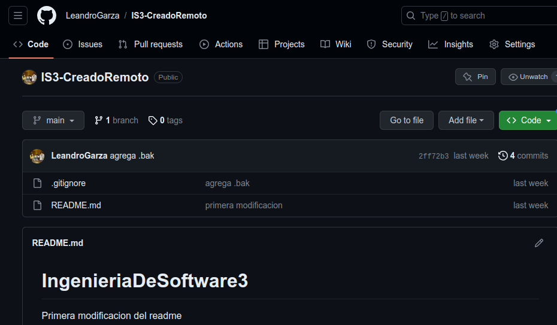

## 6 ramas
creamos una nueva rama y vamos a esta
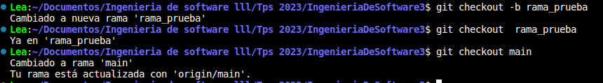
La diferencia de ramas la vemos en github en el cual podemos seleccionar en cual de las 2 ramas estamos, es decir que la nueva rama creada pusheo los cambios a la nueva rama, mientras que la rama original es decir la main lo pusheo ahi.

## 7 Merges
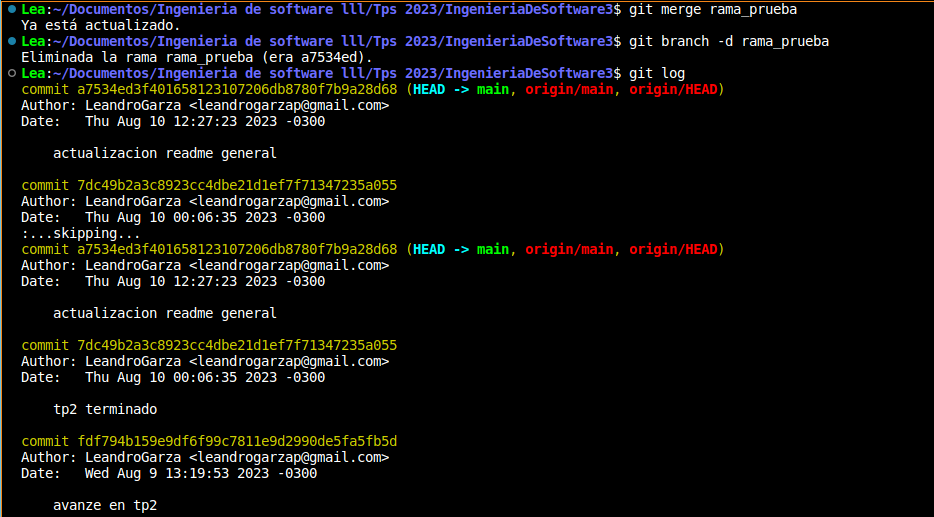

## 8 resolucion de conflictos
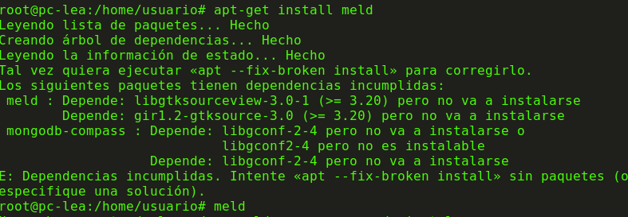

## 9 Familiarizarse con el concepto de pull request
Es un mecanismo comúnmente utilizado en sistemas de control de versiones como Git y plataformas de desarrollo colaborativo como GitHub. Un PR permite a los desarrolladores proponer cambios en un repositorio y solicitar que esos cambios se incorporen en una rama diferente, generalmente en la rama principal (como "master" o "main"). El propósito principal de un PR es facilitar la revisión y la colaboración en el proceso de desarrollo.

creamos una nueva rama llamada rama_prueba y subimos esta a github
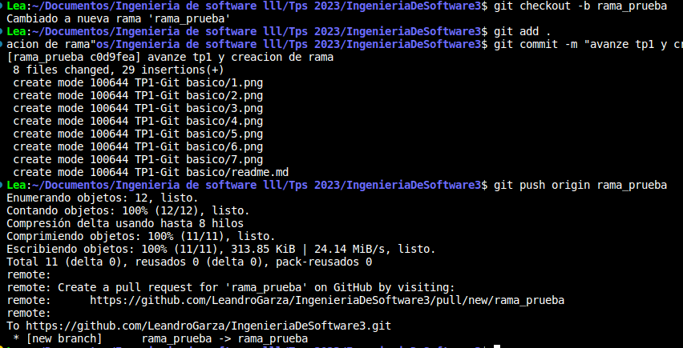

luego creamos un pull request
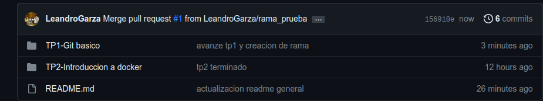

## 10 algunos ejercicios online
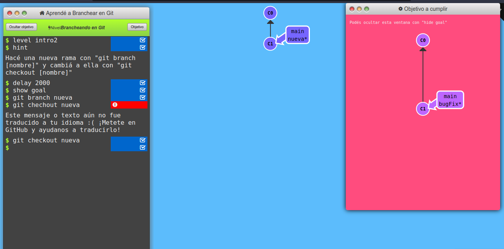

## 11 crear repositorio de la materia
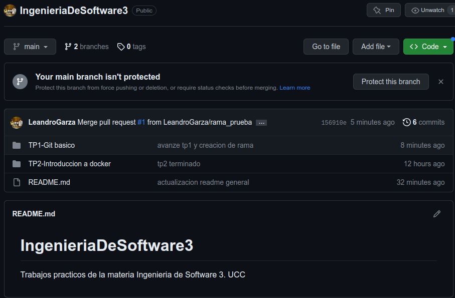