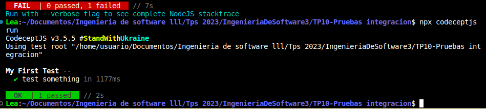
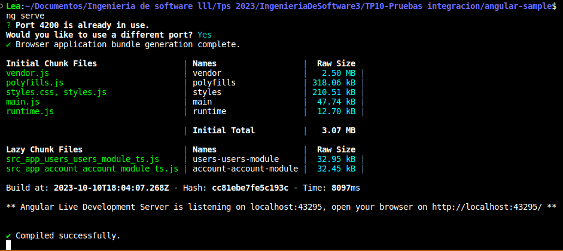

## 2- Testeando la página de GitHub

lo primero a hacer es crear el concept js

luego lo inicializamos con los valores que nos da el tp

finalmente ponemos a github 

ponemos a correr el test y ademas de la siguiente captura, vemos que se nos abre github en el navegador
Osea automatizamos el browser. Tuvimos 1 test y tuvo exito

luego cambiamos el codigo del sample_test para ver otros escenarios, y uego tiramos nuevamente el comando para correr el test pero vemos que esta vez falla. Esto se debe a que pudo ver github pero no pudo ver el confor

finalmente actualizamos nuevamente el codigo de scenario para que nos tire exito nuevamente

## 3- Testeando una aplicación Angular

una vez que clonamos el repo, tiramos el npm install para instalar todas las dependencias 

ahora procedemos a tirar el comando ng serve para abrir la interfaz y crearnos una cuenta

y podemos logearnos normalmente mientras sigamos escuchando en este puerto

luego en otra consola tiramos el create-conceptjs para luego inicializarlo con los valores de por defecto pero en la url le vamos a poner el puerto 4200 de nuestro localhost

luego procedemos a hacer una funcion para un login correcto y otra funcion para un login incorrecto en el sample_test.js 

Scenario('login correcto', ({ I }) => {
    I.amOnPage('http://localhost:4200/account/login');
    I.fillField('username', 'lp');
    I.fillField('password', '123456');
    I.click('Login');
    I.see('Inicio de Sesión Exitoso'); 
});

Scenario('login incorrecto', ({ I }) => {
    I.amOnPage('http://localhost:4200/account/login'); 
    I.fillField('username', 'lea'); 
    I.fillField('password', 'contraseña_incorrecta'); 
    I.click('Login'); 
    I.see('Error de Inicio de Sesión');
});

y finalmente corremos el comando ng serve

finalmente corremos y ejecutamos los tests como hicimos anteriormente
