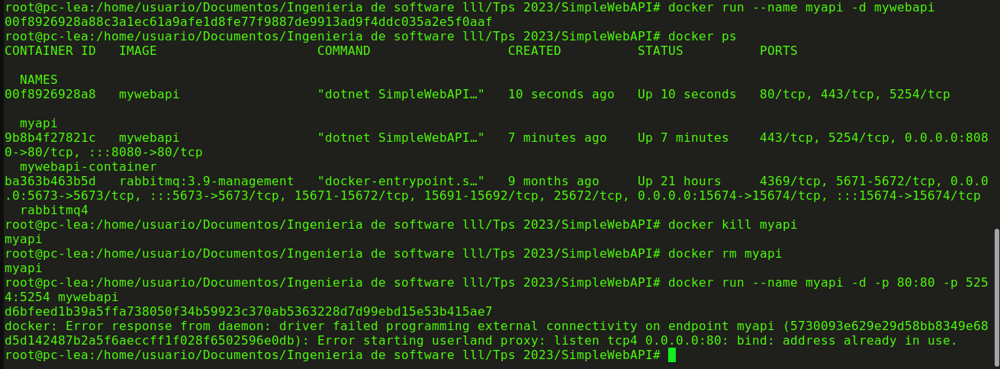
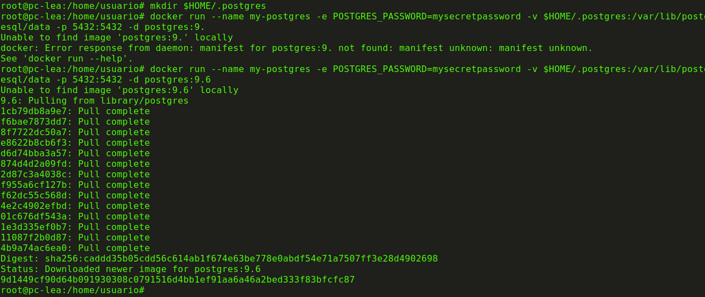
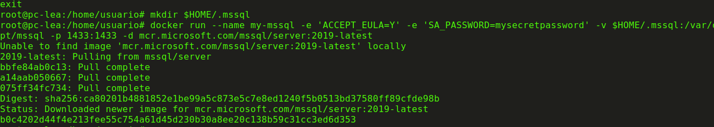

Ejercicios de desarrollo

## 1_ Ejecutamos el comando "docker version"

## 2_ Nos familiarizamos con docker hub

## 3_ Bajamos una imagen de dockerhub con el comando "docker pull busybox"

Luego vemos todas las imagenes que tenemos y sus respectivos tamaños con "docker images"

##  4_ Ejecutando contenedores

##  5_ Ejecutando en modo interactivo

##  6_ Borrando contenedores

##  7_ Construir una imagen
creamos la imgen

analizamos el dockerfile

FROM mcr.microsoft.com/dotnet/aspnet:7.0 AS base: Esta línea establece la imagen base a utilizar para la construcción. En este caso, se basa en la imagen mcr.microsoft.com/dotnet/aspnet:7.0, que proporciona el entorno de ejecución ASP.NET Core.

WORKDIR /app: Establece el directorio de trabajo dentro del contenedor en /app.

EXPOSE 80, EXPOSE 443, EXPOSE 5254: Expone los puertos 80, 443 y 5254 del contenedor. Estos puertos son típicamente utilizados para el tráfico HTTP y HTTPS en aplicaciones web.

FROM mcr.microsoft.com/dotnet/sdk:7.0 AS build: Define una nueva etapa de construcción basada en la imagen mcr.microsoft.com/dotnet/sdk:7.0. Esta etapa se utilizará para compilar la aplicación.

WORKDIR /src: Establece el directorio de trabajo dentro del contenedor en /src.

COPY ["SimpleWebAPI/SimpleWebAPI.csproj", "SimpleWebAPI/"]: Copia el archivo de proyecto .csproj de la aplicación al directorio de trabajo en el contenedor.

RUN dotnet restore "SimpleWebAPI/SimpleWebAPI.csproj": Ejecuta el comando dotnet restore para restaurar las dependencias del proyecto.

COPY . .: Copia todos los archivos del contexto de construcción (incluyendo el código fuente) al directorio de trabajo en el contenedor.

WORKDIR "/src/SimpleWebAPI": Cambia el directorio de trabajo al subdirectorio de la aplicación.

RUN dotnet build "SimpleWebAPI.csproj" -c Release -o /app/build: Compila la aplicación en modo Release y guarda los resultados en el directorio /app/build.

FROM build AS publish: Define una nueva etapa de construcción basada en la etapa build. Esta etapa se utilizará para publicar la aplicación.

RUN dotnet publish "SimpleWebAPI.csproj" -c Release -o /app/publish /p:UseAppHost=false: Publica la aplicación en modo Release y guarda los resultados en el directorio /app/publish.

FROM base AS final: Define una nueva etapa final basada en la etapa base. Esta etapa se utilizará para la imagen final.

WORKDIR /app: Cambia el directorio de trabajo al directorio /app.

COPY --from=publish /app/publish .: Copia los archivos publicados de la etapa publish al directorio de trabajo en el contenedor.

ENTRYPOINT ["dotnet", "SimpleWebAPI.dll"]: Establece el punto de entrada para ejecutar la aplicación cuando se inicie el contenedor.

Vemos la imagen nueva creada y luego creamos su contenedor

La subimos a docker hub

##  8_ Publicando puertos

Ejecutamos la imagen
 
Ejecutamos un docker ps y observamos que el contenedor esta corriendo en el puerto 80 y 443, pero si intentamos en un navegador acceder a http://localhost no sucede nada.

Procedemos entonces a parar y remover este contenedor:

Vamos a volver a correrlo otra vez, pero publicando uno de los puertos solamente, en este caso el 80

##  9_ Modificar dockerfile para soportar bash

modificamos el docker file

rehacemos la imagen

le asignamos un puerto que no este ocupado

finalmente tiramos el comando "dotnet SimpleWebAPI.dll" para que podamos abrir el localhost.

## 10_ Montando volumenes
Ejecutamos el comando y dentro del contenedor creamos el archivo hola.txt

## 11_ Utilizando una bd
Levantamos una bd postgree

ejecutamos sentencias utilizando esa instancia

con el comando docker run crea y ejecuta un contenedor de PostgreSQL versión 9.4 en segundo plano, con un nombre, contraseña de administrador, un volumen persistente para almacenar los datos y la asignación de puertos para la comunicación con la base de datos. Es útil para configurar rápidamente una instancia de PostgreSQL para desarrollo o pruebas.

el docker exec al ejecutar este comando, se te otorga acceso a la línea de comandos dentro del contenedor de PostgreSQL. Esto puede ser útil para realizar tareas de administración, depuración, configuración u otras acciones directamente en el entorno del contenedor, como si estuvieras dentro de una máquina virtual o un servidor. Ten en cuenta que el intérprete de comandos puede variar según la imagen del contenedor. En este caso, estás utilizando /bin/bash, pero otras imágenes podrían usar diferentes intérpretes o shells.

## 12_ hacer el punto 11 con microsoft sql server

ejecutamos el docker run

luego el exec
docker exec -it my-mssql /opt/mssql-tools/bin/sqlcmd -S localhost -U sa -P mysecretpassword

finalmente

-- Crear una nueva base de datos
CREATE DATABASE test;

-- Usar la nueva base de datos
USE test;

-- Crear una tabla
CREATE TABLE tabla_a (mensaje NVARCHAR(50));

-- Insertar datos en la tabla
INSERT INTO tabla_a (mensaje) VALUES ('Hola mundo!');

-- Consultar datos en la tabla
SELECT * FROM tabla_a;

-- Salir de la base de datos
USE master;

-- Salir de la interfaz de SQL Server
EXIT;
