Realizamos los ejercicios del TP3.

## 1 Sistema distribuido simple

En la siguiente captura creamos la red en docker, instanciamos la bd Redis y levantamos una app
que utilice esta bd
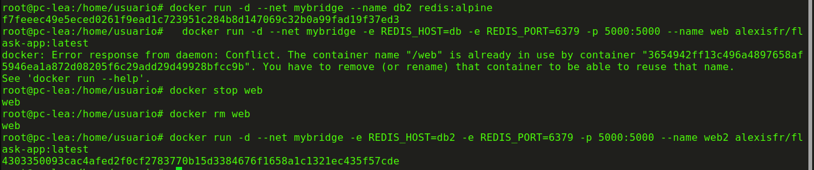

ademas podemos ver la imagen de redis en la interfaz grafica de docker
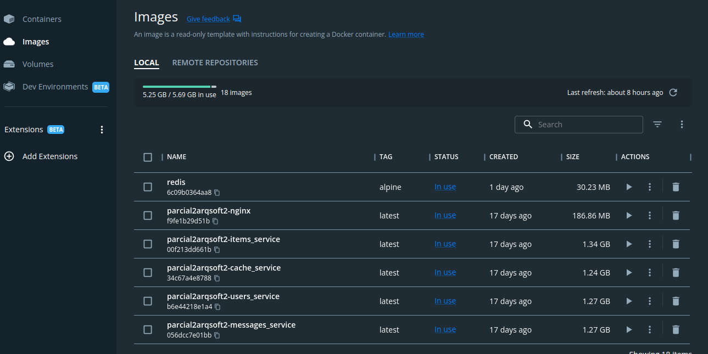

luego en el navegador vamos al localhost 5000 y obtenemos lo siguiente
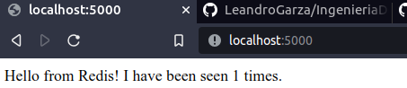

finalmente vemos el estado de los contenedores, de las redes y vemos detalles de mybridge
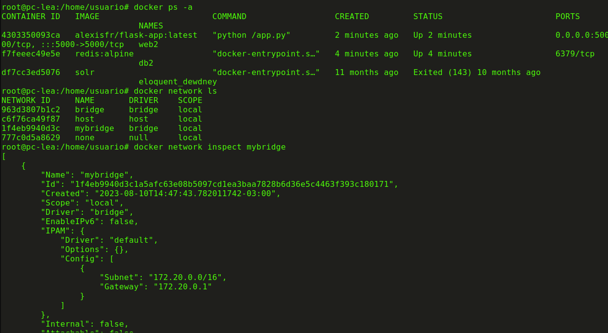

## 2 analisis de sistema

 este codigo utiliza Flask para crear un servidor que responde a solicitudes en la ruta / y se comunica con una base de datos Redis para realizar un seguimiento del número de visitas. Cada vez que un usuario accede a la página, el contador de visitas en Redis se incrementa y se muestra un mensaje que indica cuántas veces se ha visitado la página. La aplicación se puede ejecutar en un contenedor Docker, y las variables de entorno se utilizan para configurar la conexión a la base de datos Redis y el puerto en el que se ejecuta el servidor.

---------------------------------------------------------------------------------------------

 Luego sobre el comando -e:
 -e REDIS_HOST=db: Establece una variable de entorno llamada REDIS_HOST con el valor db. Esto se utiliza para configurar la dirección de host en la que se encuentra la instancia de Redis a la que la aplicación Flask se conectará.

-e REDIS_PORT=6379: Establece una variable de entorno llamada REDIS_PORT con el valor 6379. Esto se utiliza para configurar el puerto en el que se encuentra la instancia de Redis a la que la aplicación Flask se conectará.

---------------------------------------------------------------------------------------

Si ejecutas docker rm -f web para eliminar el contenedor con nombre "web" y luego vuelves a ejecutar docker run para crear un nuevo contenedor con el mismo nombre y configuración, ocurrirá lo siguiente:

Al borrar el contenedor "web" con docker rm -f web, el contenedor se detendrá y se eliminará, lo que significa que la aplicación web ya no estará disponible en el puerto 5000.

Luego, al ejecutar docker run para crear un nuevo contenedor con nombre "web" y la misma configuración, la aplicación web se volverá a ejecutar y estará disponible en el puerto 5000. Sin embargo, como el contenedor de Redis (con nombre "db") aún está disponible, la aplicación Flask seguirá funcionando normalmente y contará las visitas utilizando la instancia de Redis.

Si luego ejecutas docker rm -f db para borrar el contenedor de Redis, la aplicación Flask ya no podrá conectarse a la base de datos Redis. Esto podría resultar en un error o en un comportamiento inesperado, dependiendo de cómo esté implementada la lógica en la aplicación.

Si vuelves a ejecutar docker run para crear un nuevo contenedor de Redis con el mismo nombre "db", la aplicación Flask podrá conectarse nuevamente a la base de datos Redis. Sin embargo, las visitas acumuladas hasta ese momento se perderán, ya que la instancia de Redis se reinició.

-------------------------------------------------------------------------------------------

Para evitar perder la cuenta de las visitas cuando los contenedores se detienen o reinician, podrías considerar algunas opciones:

Utilizar un servicio externo de almacenamiento persistente, como una base de datos Redis en un servidor independiente o en un servicio de nube, para almacenar la cuenta de visitas. Esto aseguraría que los datos se mantengan incluso si los contenedores se reinician.

Modificar la aplicación Flask para que almacene la cuenta de visitas en un archivo persistente dentro del contenedor, en un volumen montado o en un servicio externo de almacenamiento.

Utilizar una solución de orquestación de contenedores, como Docker Compose o Kubernetes, que facilite la gestión de los contenedores y sus interdependencias.

## 3 utilizando docker compose

una vez que creamos el archivo, que vemos en esta misma carpeta, tiramos el comando que adjuntamos en 
pantalla 

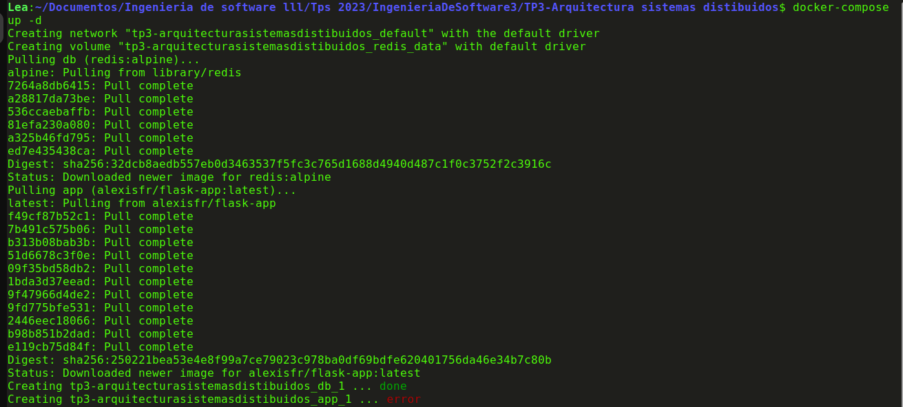

le cambiamos el puerto ya que me tiro error y ahora si muestra lo siguiente
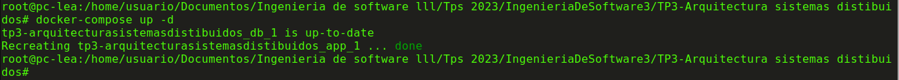

en el docker ps, el network ls y volume ls vemos lo siguiente
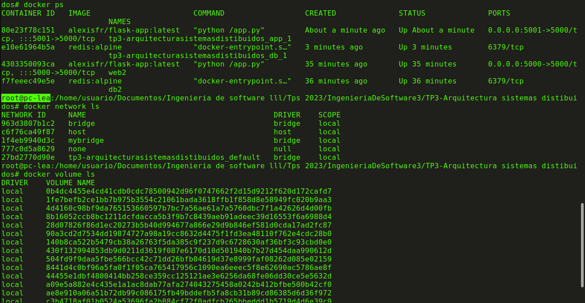

En resumen, docker-compose up -d automatiza el proceso de creación, configuración y ejecución de múltiples contenedores como una aplicación única utilizando la definición proporcionada en el archivo docker-compose.yml. Esto simplifica la gestión de aplicaciones compuestas por varios servicios y mejora la portabilidad y consistencia del entorno de desarrollo y producción.

finalmente tiramos el docker-compose down
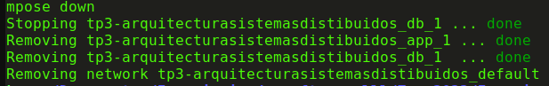

## 4 analisis de otro sistema distribuido

una vez que clonamos el repo, tiramos el docker compose up
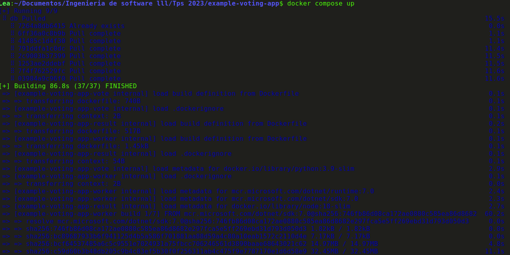

y una vez que hacemos esto, abrimos los local host en los puertos 5000 y 5001:
En el puerto 5000: es donde puedes votar por perros o gatos.

En el puerto 5001: puedes ver los resultados de la votación. Deberías poder ver cuántos votos ha recibido cada opción (perros y gatos) en tiempo real.

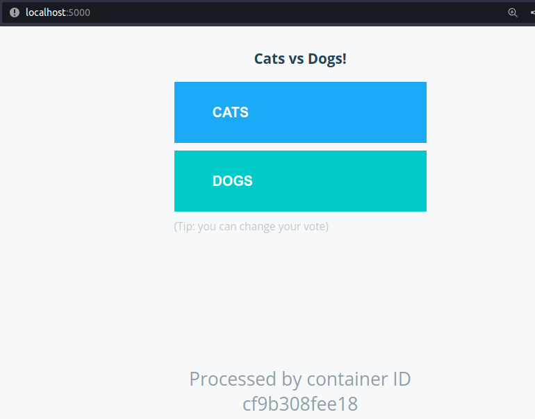

El sistema de ejemplo de la aplicación de votación (example-voting-app) está configurado utilizando Docker Compose para orquestar varios componentes en contenedores Docker.

En resumen, la aplicación utiliza cinco servicios en contenedores:

vote y result son las aplicaciones de votación y resultados respectivamente, con sus respectivas interfaces de usuario en los puertos 5000 y 5001.

redis es una base de datos en memoria utilizada para almacenar datos temporales.

db es una base de datos PostgreSQL utilizada para almacenar los resultados de la votación.

Docker Compose orquesta estos componentes y crea una red personalizada (front-tier) para que los contenedores se comuniquen entre sí. Los mapeos de puertos permiten acceder a las interfaces de usuario de votación y resultados desde el host en los puertos 5000 y 5001, respectivamente.

## 5 analisis detallado

el codigo de app.py: La función get_redis() se define para obtener una conexión a la base de datos Redis. Si no existe ya una conexión en el contexto actual (almacenada en el objeto g), se crea una nueva conexión a la instancia de Redis. Esto permite reutilizar la conexión en varias solicitudes.

Se define una ruta ("/") para la página principal de la aplicación. Cuando se accede a esta ruta, se verifica si el votante ya tiene una ID de votante almacenada en las cookies. Si no la tiene, se genera una nueva ID en hexadecimal.

Si se recibe una solicitud POST (cuando el usuario envía un voto), la función obtiene la conexión a Redis usando get_redis(). Luego, extrae el voto del formulario enviado y lo registra en Redis utilizando redis.rpush('votes', data), donde data es un objeto JSON que contiene la ID del votante y su voto.

------------------------------------------------------------------------------------------------

En la siguiente direccion example-voting-app\worker\src\main\java\worker\Worker.java
no se encuentra mas un archivo denominado worker.java

------------------------------------------------------------------------------------------------
 
El codigo que se encuentra en example-voting-app\result\server.j muestra los valores de la siguiente manera: establece un servidor Node.js con Express y Socket.IO que se conecta a una base de datos PostgreSQL, obtiene los votos almacenados en la base de datos y los envía en tiempo real a través de Socket.IO a los clientes conectados. La página HTML mostrada a los clientes se encuentra en la carpeta views y utiliza JavaScript para mostrar los votos en tiempo real.

---------------------------------------------------------------------------------------------
Documento de Arquitectura: Ejemplo de Aplicación de Votación con Docker

Introducción
Este documento describe la arquitectura de una aplicación de votación utilizando contenedores Docker, basada en el repositorio "dockersamples/example-voting-app". La aplicación permite a los usuarios emitir votos y visualizar los resultados de la votación en tiempo real.

Objetivos
El objetivo principal de este sistema es proporcionar un ejemplo práctico de cómo construir y desplegar una aplicación utilizando contenedores Docker. La arquitectura se centra en la escalabilidad, la modularidad y la independencia de los componentes.

Arquitectura General
La aplicación de votación consta de varios componentes interconectados, cada uno encapsulado en un contenedor Docker independiente. Estos componentes son:

Voting App (vote/): Permite a los usuarios emitir votos por una de las dos opciones. Los votos se almacenan en la base de datos.

Result App (result/): Muestra los resultados de la votación en tiempo real, obteniendo los datos de la base de datos.

Worker (worker/): Procesa los votos y actualiza los resultados en la base de datos. Se comunica con la aplicación de votación y la aplicación de resultados.

finalmente realizo un diagrama de bloques y de secuencias
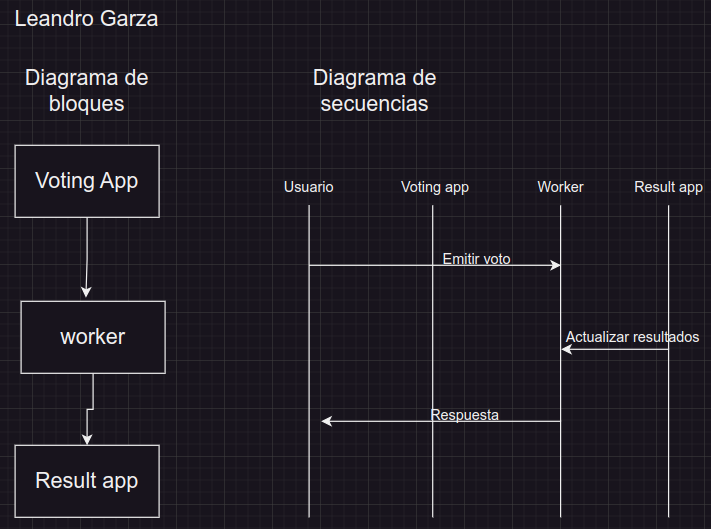

Interacción entre Componentes
El usuario interactúa con la aplicación de votación a través de una interfaz web. Al emitir un voto, la aplicación de votación envía una solicitud al componente Worker.

El componente Worker recibe y procesa el voto, luego actualiza la base de datos con el nuevo resultado.

La aplicación de resultados consulta periódicamente la base de datos para obtener los resultados actualizados y los muestra en la interfaz web.