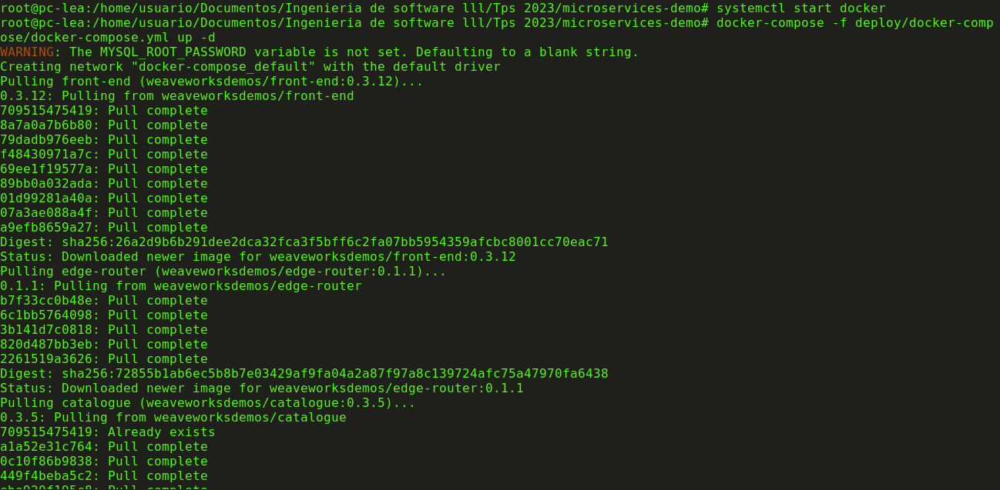
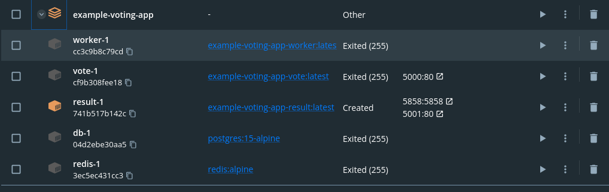
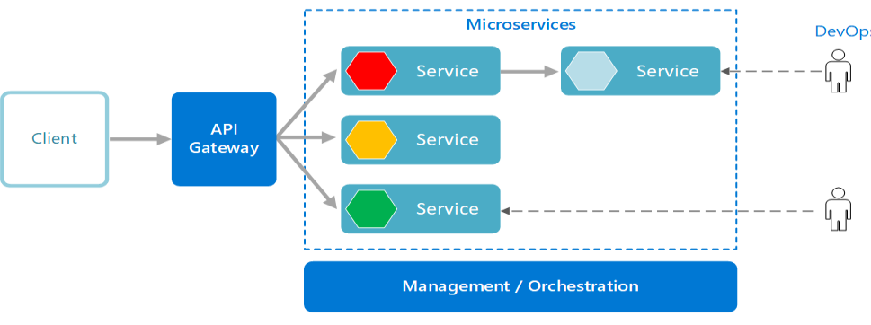
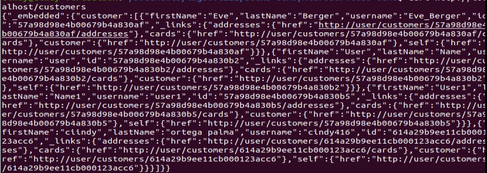
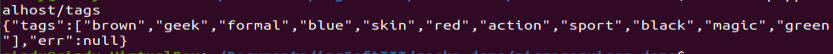

Resolucion de ejercicios del TP4

## 1 instanciacion del sistema

una vez parados en el repositorio que acabamos de clonar "microservicios demo" tiramos el siguiente comando

luego de tirar el comando y de cambiar el puerto ya que viene por defecto en el puerto 80, el cual es el mas utilizado generalmente... accedemos desde el navegador al localhost:8888

creamos usuario

y podemos llenar el carrito para posteriormente pasar al pago

## 2 Investigacion de los componentes

1
vemos el siguiente container en nuestro docker desktop

-----------------------------------------------------------------------------------------------------
3

La separación de código y/o configuración en repositorios separados en un sistema de microservicios como este puede tener varios beneficios y desafíos. Aquí hay algunos puntos a favor y en contra:

Puntos a favor de usar repositorios separados:

Aislamiento y desacoplamiento: Cada microservicio puede desarrollarse, probarse y desplegarse de manera independiente. Los cambios en un servicio no afectan directamente a otros, lo que permite un mayor aislamiento y desacoplamiento.

Escalabilidad y paralelismo: Al tener repositorios separados, los equipos de desarrollo pueden trabajar en paralelo en diferentes servicios sin bloquearse mutuamente. Esto facilita la escalabilidad y acelera el desarrollo.

Gestión de versiones: Cada microservicio tiene su propio control de versiones, lo que permite un seguimiento más preciso de los cambios y la capacidad de realizar versiones específicas de manera independiente.

Flexibilidad tecnológica: Los diferentes microservicios pueden estar escritos en diferentes lenguajes de programación o tecnologías, lo que permite elegir la mejor herramienta para cada caso.

Desafíos de usar repositorios separados:

Complejidad de la configuración: La gestión de la configuración y la comunicación entre microservicios puede volverse complicada, especialmente a medida que aumenta el número de servicios.

Problemas de coherencia: Mantener la coherencia entre diferentes repositorios puede ser un desafío. Cambios en un servicio podrían requerir cambios en otros servicios, lo que puede ser difícil de gestionar.

Descubrimiento de servicios: Encontrar y conectarse a los diferentes servicios puede requerir mecanismos adicionales, como un registro de servicios o un servicio de descubrimiento.

-----------------------------------------------------------------------------------------------------
4
en el repositorio "microservices-demo/edge-router.git" es el que hace las veces de API Gateway. El término "edge router" se refiere a un componente que actúa como punto de entrada para las solicitudes externas hacia los diferentes microservicios, proporcionando funciones de enrutamiento, autenticación, autorización, balanceo de carga, entre otros. En este caso, el contenedor relacionado con el repositorio "edge-router.git" está configurado como el API Gateway para este sistema de microservicios.

------------------------------------------------------------------------------------------------------
5 - 6
En el sistema de microservicios, cada uno de los comandos curl se comunica con un servicio específico para obtener la información requerida.

curl http://localhost/customers:
El servicio que procesa la operación depende de la arquitectura específica del sistema. En general, este comando podría estar siendo manejado por un microservicio relacionado con la gestión de clientes.

7
curl http://localhost/catalogue:
Este comando se comunica con un microservicio responsable de gestionar el catálogo de productos.

curl http://localhost/tags:
Este comando se comunica con un microservicio que maneja las etiquetas o categorías de productos.

--------------------------------------------------------------------------------------------
8 
Cada servicio que requiere persistencia de datos (ej. user) tiene un container acompañante, en el cual persisten su datos (en el ejemplo dado, user-db_1). En este ejemplo se utiliza principalmente mongodb

En cuanto a la persistencia de datos y la comunicación entre microservicios:

Persistencia de Datos: Cada microservicio puede utilizar su propio sistema de persistencia de datos. Puede haber bases de datos independientes para cada servicio o un servicio podría utilizar un almacén de datos compartido, como una base de datos relacional o no relacional.

9
el 'queue master'
Procesamiento de Cola de Mensajes: El componente encargado del procesamiento de la cola de mensajes podría ser un servicio independiente o un módulo dentro de un microservicio específico. Suele utilizarse una herramienta de cola de mensajes como RabbitMQ, Apache Kafka o similar para administrar la comunicación asíncrona entre microservicios.

10
Se comunican entre sí utilizando REST
Interfaz de Comunicación: Los microservicios generalmente se comunican entre sí utilizando una variedad de métodos, como HTTP/HTTPS (RESTful API), gRPC, AMQP (Advanced Message Queuing Protocol), etc. El método exacto dependerá de la arquitectura y las tecnologías elegidas en el sistema.