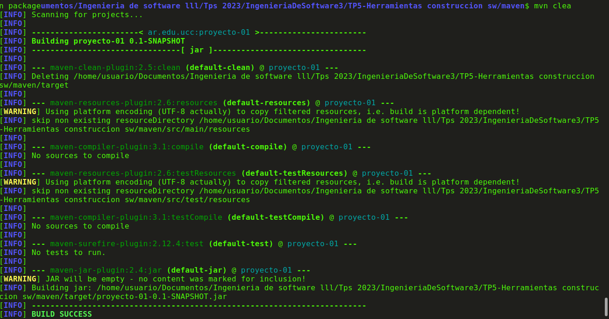
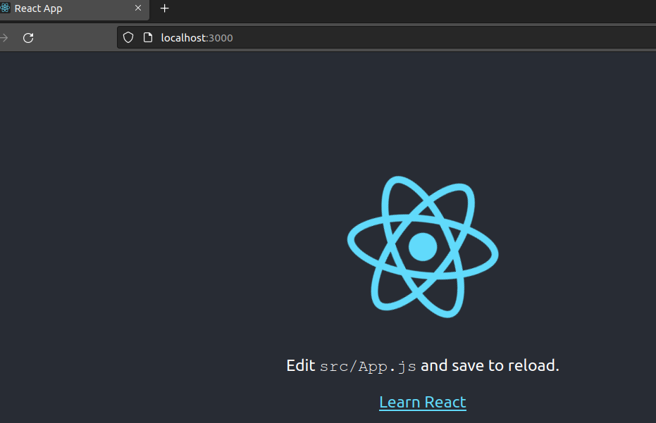

Resolucion de ejercicios del TP5

## 1 instalar java jdk

logramos instalar java y vemos su version tanto de java como javac

luego Agregamos la variable de entorno JAVA_HOME de manera temporal en mi caso

## 2 instalar Maven
instalamos maven y una vez instalado verificamos que se haya instalado correctamente

agregamos abajo del todo el comando y vemos que nos quedo el del tp anterior.

## 3 introduccion a Maven

Maven es una herramienta de gestión y construcción de proyectos de software. Su objetivo principal es simplificar y automatizar el proceso de construcción, manejo de dependencias y distribución de proyectos. Maven utiliza un enfoque basado en convenciones para estructurar y administrar proyectos, lo que facilita la creación, prueba y distribución de software.

El archivo POM (Project Object Model) es un archivo XML que describe la configuración, dependencias y detalles del proyecto en Maven. Contiene información esencial para Maven sobre cómo construir y gestionar el proyecto. El POM define elementos como el nombre del proyecto, su versión, dependencias, complementos, fuentes de compilación, pruebas y más.

Los elementos que mencionaste son parte del archivo POM:

modelVersion: Define la versión de POM utilizada. Por lo general, se establece en "4.0.0" para las versiones modernas de Maven.

groupId: Identifica al grupo o equipo que desarrolla el proyecto. Suele estar en un formato inverso de nombres de dominio (por ejemplo, com.example).

artifactId: Es el identificador único para el proyecto o módulo. Suele ser el nombre del proyecto o módulo.

version: Indica la versión actual del proyecto. Sigue un esquema de numeración para el control de versiones.

Estos elementos ayudan a Maven a identificar, construir y gestionar proyectos y sus dependencias de manera efectiva.

---------------------------------------------------------------------------------------------------

Los ciclos de vida de construcción (build) en Maven son una serie de etapas predefinidas que guían el proceso de construcción y gestión de un proyecto. Cada ciclo de vida está compuesto por una secuencia de fases. Las fases son pasos individuales que se ejecutan en orden y realizan tareas específicas. Aquí hay una explicación de algunos ciclos de vida clave mencionados en el enlace proporcionado:

default: Este es el ciclo de vida principal y es el que se ejecuta de manera predeterminada cuando ejecutas un comando de construcción sin especificar una fase. Incluye las siguientes fases importantes:

    validate: Valida que el proyecto sea correcto y todas las necesarias estén disponibles.
    compile: Compila el código fuente del proyecto.
    test: Ejecuta las pruebas unitarias del proyecto.
    package: Empaqueta el código compilado en un formato distribuible (por ejemplo, un archivo JAR).
    verify: Ejecuta pruebas adicionales para verificar la calidad del paquete.
    install: Instala el paquete en el repositorio local para que otros proyectos puedan depender de él.
    deploy: Copia el paquete final en un repositorio remoto para su uso compartido o distribución.

clean: Este ciclo de vida se encarga de limpiar los archivos generados previamente durante la construcción. Incluye la fase clean, que elimina los archivos y directorios generados en la construcción anterior.

site: Este ciclo de vida se enfoca en generar informes y documentación del proyecto. Incluye la fase site, que genera documentación del proyecto y presenta informes.

luego de crear el archivo pom.xml y pegar el codigo dentro de el, tiramos el comando mvn clean install y obtuvimos la siguiente rta

y termina con un mensaje de build success como el siguiente

Las concluciones que podemos sacar son:

Limpieza (clean): La fase clean elimina los archivos generados previamente en construcciones anteriores. Puedes esperar ver mensajes que indiquen que los directorios de destino se están limpiando.

Construcción e instalación (install): La fase install compila tu proyecto, empaqueta los artefactos y los instala en el repositorio local de Maven. Puedes esperar ver mensajes que muestren las etapas de compilación, pruebas y empaquetado.

Salida exitosa: Si el proceso de construcción e instalación se completó correctamente, verás mensajes que indican que las pruebas se han ejecutado sin errores y que los artefactos se han instalado en el repositorio local.

Detalles del proyecto: El archivo POM proporcionado contiene detalles sobre el proyecto, como su groupId, artifactId y version. Estos valores se utilizan para identificar y gestionar el proyecto en Maven.

Finalización: Si no se presentaron errores durante el proceso, deberías ver un mensaje que indique que la construcción se completó correctamente.

## 4 Maven continuacion 

luego de tirar el comando mvn archetype:generate -DgroupId=ar.edu.ucc -DartifactId=ejemplo -DarchetypeArtifactId=maven-archetype-quickstart -DinteractiveMode=false vemos fases del proceso como el siguiente

luego vemos analizamos la estructura generada con el comando tree.

compilamos el proyecto con mvn clean package

finalmente el ultimo comando

## 6 Manejo de dependencias (no hay ##5)

creamos el nuevo proyecto

vemos nuevamente como quedaron las estructuras de carpetas con el comando tree

y finalmente modificamos el codigo de app.java quedandonos de la siguiente manera

luego de compilar y ejecutar el codigo vemos el siguiente problema

agregamos las dependencias al codigo pom.xml y luego de compilar

me faltaron los ultimos dos pasos

## 7 Utilizar una IDE

decido instalar intellij idea en mi ubuntu

luego abrimos la interfaz grafica y procedemos a importar el archivo del proyecto

## 8 ejemplo con nodejs

verificamos que tengamos instaldo node js y npm

luego procedemos a crear la nueva aplicacion.

finalmente accedemos a la carpeta my-app y tiramos el npm start lo cual me abre la siguiente interfaz
grafica.

mientras que la terminal en la que ejecute el npm start muestra lo siguiente

El manejo de paquetes y dependencias realizado por npm es fundamental para el desarrollo de aplicaciones en React (y en muchos otros proyectos). Aquí hay una explicación general de cómo funciona:

npm (Node Package Manager): npm es un administrador de paquetes que te permite instalar, actualizar y administrar las bibliotecas de código (paquetes) que tu proyecto necesita para funcionar. Estos paquetes pueden ser bibliotecas de terceros, como React, o herramientas de desarrollo, como Create React App.

package.json: En el directorio raíz de tu proyecto, encontrarás un archivo llamado package.json. Este archivo es una descripción de tu proyecto y sus dependencias. Contiene información sobre el nombre del proyecto, la versión, los scripts de npm, y más importante, la lista de dependencias y versiones que tu proyecto necesita.

Dependencias: Las dependencias son paquetes externos que tu proyecto necesita para funcionar. Estos paquetes se instalan localmente en la carpeta del proyecto y se especifican en el archivo package.json. Cuando ejecutas npm install nombre-del-paquete, npm descarga y almacena las dependencias en la carpeta node_modules.

DevDependencies: Algunas dependencias son solo necesarias durante el desarrollo, como herramientas de compilación, pruebas y depuración. Estas dependencias se especifican en la sección devDependencies de package.json.

npm install: Para instalar todas las dependencias especificadas en package.json, ejecutas el comando npm install. Esto leerá las dependencias y devDependencies del archivo y descargará los paquetes correspondientes en la carpeta node_modules.

npm start: El comando npm start (o npm run start) se define en package.json como un script. En el contexto de una aplicación de React, npm start inicia el servidor de desarrollo para tu aplicación, que se ejecuta en un servidor local y refleja los cambios en tiempo real mientras desarrollas.

localhost:3000: Después de ejecutar npm start, la aplicación estará disponible en la dirección http://localhost:3000 en tu navegador. Puedes acceder a esta dirección para interactuar con tu aplicación en el entorno de desarrollo.

## 9 ejemplo con python

instalamos dependencias

corremos el scaffold

Las herramientas como Cookiecutter, Make y Pip son herramientas populares en el desarrollo de software que ayudan a automatizar y simplificar tareas comunes durante el proceso de desarrollo y administración de proyectos.

Cookiecutter:
te permite crear plantillas o "templates" para iniciar proyectos con una estructura y configuración predefinida. En lugar de tener que configurar manualmente cada nuevo proyecto desde cero, puedes utilizar Cookiecutter para generar automáticamente una estructura de proyecto consistente con características predefinidas. Esto ahorra tiempo y ayuda a mantener la coherencia entre diferentes proyectos.

Make:
Make es una herramienta de automatización de tareas que se utiliza comúnmente en entornos de desarrollo. Permite definir reglas para compilar, ejecutar y administrar proyectos de manera eficiente. A través de un archivo llamado "Makefile", puedes especificar cómo se deben realizar ciertas tareas, como compilar código fuente, ejecutar pruebas, construir artefactos y más.

Pip:
Pip es el sistema de gestión de paquetes para Python. Te permite instalar y administrar bibliotecas de terceros (paquetes) en tus proyectos de Python de manera sencilla. Con Pip, puedes instalar paquetes desde el repositorio central de Python (PyPI) y gestionar sus versiones y dependencias.
Por ejemplo, si estás desarrollando una aplicación en Python y necesitas utilizar una biblioteca externa, como "requests" para realizar solicitudes HTTP, puedes usar Pip para instalarla con un simple comando, como pip install requests. Pip se encargará de descargar y configurar la biblioteca para que puedas utilizarla en tu proyecto.

## 10 build tools para otros lenguajes.

Voy a elegirlas en orden de las que sepa mas a menos

1_ C++: CMake, GNU Make, Bazel

2_ C: Make, CMake

3_ JavaScript: npm (Node.js), Yarn (Node.js), webpack

4_ Python: Pipenv, Poetry, setuptools

5_ Java: Apache Maven, Gradle, Ant

6_ C#: MSBuild, NuGet

7_ PHP: Composer

8_ Swift: Swift Package Manager

9_ Ruby: Bundler, Rake

10_ Rust: Cargo