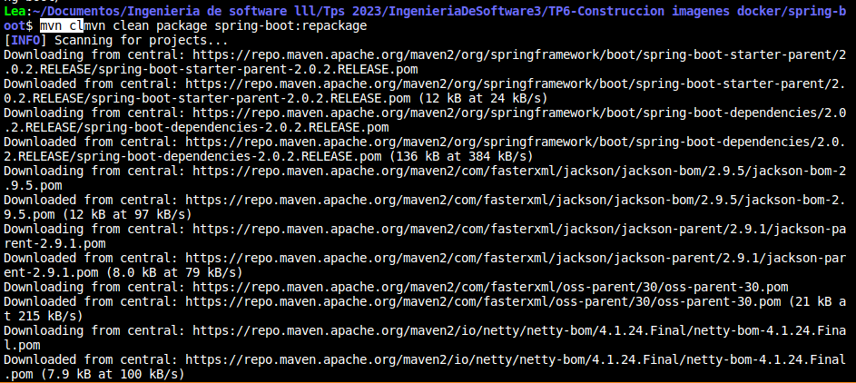
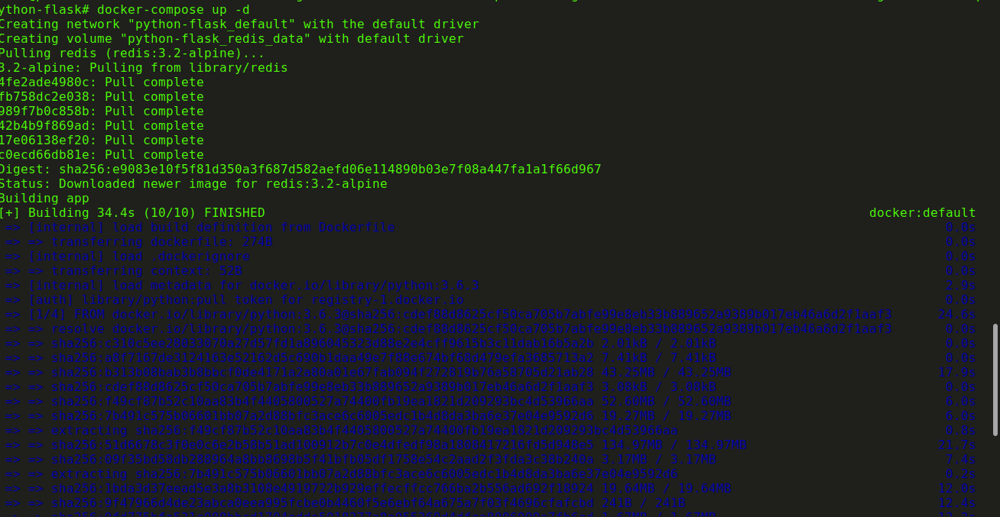
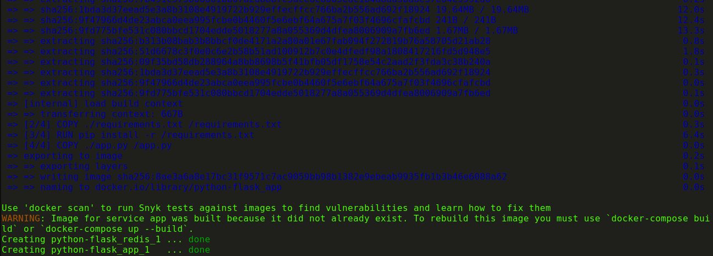
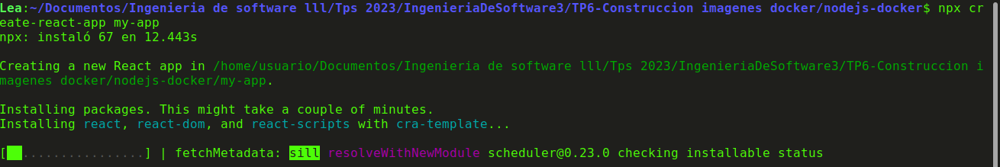
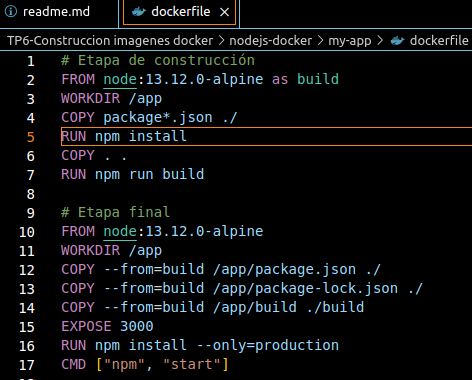
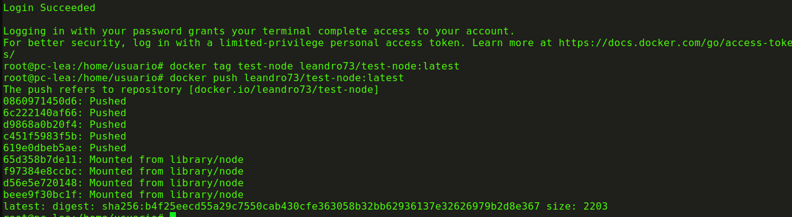

Realizacion de la parte de desarrollo del TP6 "construccion de imagenes de docker".

## 1 conceptos de dockerfile

FROM
se utiliza para especificar la imagen base desde la cual se va a construir la nueva imagen. Es la primera instrucción que se coloca en un Dockerfile. Define el punto de partida para la construcción de la imagen y generalmente es una imagen oficial de Docker Hub o una imagen personalizada.

RUN
se utiliza para ejecutar comandos en una nueva capa sobre la imagen actual y luego guardarla como una nueva capa en la imagen. Se utiliza para instalar paquetes, configurar el entorno y realizar acciones durante la construcción de la imagen.

ADD y COPY
Ambas instrucciones se utilizan para copiar archivos y directorios en la imagen, pero con algunas diferencias clave:

ADD tiene algunas características adicionales, como la capacidad de extraer archivos comprimidos automáticamente y copiar archivos desde URLs. Es más versátil pero puede ser menos predecible.
COPY simplemente copia archivos y directorios desde el contexto de construcción al sistema de archivos de la imagen. Es más predecible y se recomienda para la mayoría de los casos.

EXPOSE
se utiliza para especificar los puertos en los que el contenedor va a escuchar durante la ejecución. No abre puertos en el host o habilita la comunicación directa, solo documenta la intención del contenedor.

CMD
se utiliza para proporcionar un comando o un conjunto de comandos predeterminados que se ejecutarán cuando se inicie el contenedor. Puede ser sobrescrito por comandos proporcionados al ejecutar el contenedor, pero solo el último comando proporcionado se ejecutará.

ENTRYPOINT
se utiliza para configurar el comando que se ejecutará cuando se inicie el contenedor, y cualquier argumento proporcionado al ejecutar el contenedor se pasa como argumentos al comando ENTRYPOINT. A diferencia de CMD, los argumentos proporcionados no sobrescriben el comando principal, sino que se pasan a él.

## 2 generar imagen de docker
una vez que clonamos el repositorio y entramos a la carpeta, tiramos el comando como vemos en imagen

luego agregamos el codigo proporcionado al archivo llamado dockerfie y procedemos a tirar el siguiente comando, el cual como nunca funcionaba, trate con otro repositorio con el comando 

docker pull adoptopenjdk/openjdk8:alpine

y tampoco pude

## 3 dockerfile multi etapas

Este Dockerfile de múltiples etapas, se utiliza para compilar una imagen Docker de una aplicación ASP.NET. Este enfoque es especialmente útil cuando deseas crear imágenes Docker optimizadas que sean pequeñas y contengan solo los componentes necesarios para ejecutar tu aplicación.

-----------------------------------------------------------------------------------
Primera Etapa (base):

FROM mcr.microsoft.com/dotnet/aspnet:7.0 AS base
WORKDIR /app
EXPOSE 80

FROM mcr.microsoft.com/dotnet/aspnet:7.0 AS base: En esta línea, se inicia la primera etapa de construcción de la imagen Docker. Se utiliza la imagen base mcr.microsoft.com/dotnet/aspnet:7.0, que proporciona una base mínima para aplicaciones ASP.NET en .NET 7.0. Esta etapa se etiqueta como "base" para que pueda ser referenciada en etapas posteriores.

WORKDIR /app: Establece el directorio de trabajo en /app dentro del contenedor.

EXPOSE 80: Expone el puerto 80 del contenedor, que es el puerto por defecto para las aplicaciones web ASP.NET.

------------------------------------------------------------------------------
Segunda Etapa (build):

FROM mcr.microsoft.com/dotnet/sdk:7.0 AS build
WORKDIR /src
COPY ["MiProyectoWebAPI.csproj", "."]
RUN dotnet restore "./MiProyectoWebAPI.csproj"
COPY . .
WORKDIR "/src/."
RUN dotnet build "MiProyectoWebAPI.csproj" -c Release -o /app/build
FROM mcr.microsoft.com/dotnet/sdk:7.0 AS build: Comienza la segunda etapa de construcción, utilizando la imagen mcr.microsoft.com/dotnet/sdk:7.0. Esta etapa se etiqueta como "build".

WORKDIR /src: Establece el directorio de trabajo en /src dentro del contenedor.

COPY ["MiProyectoWebAPI.csproj", "."]: Copia el archivo de proyecto MiProyectoWebAPI.csproj al directorio actual del contenedor. Esto se hace antes de restaurar las dependencias para aprovechar el almacenamiento en caché de Docker.

RUN dotnet restore "./MiProyectoWebAPI.csproj": Ejecuta dotnet restore para restaurar las dependencias del proyecto.

COPY . .: Copia todo el contenido del proyecto al directorio actual del contenedor.

WORKDIR "/src/.": Establece nuevamente el directorio de trabajo en el directorio actual.

RUN dotnet build "MiProyectoWebAPI.csproj" -c Release -o /app/build: Compila el proyecto en modo Release y coloca los archivos de salida en el directorio /app/build del contenedor.

--------------------------------------------------------------------------------------
Tercera Etapa (publish):

FROM build AS publish
RUN dotnet publish "MiProyectoWebAPI.csproj" -c Release -o /app/publish /p:UseAppHost=false
FROM build AS publish: Esta es una instrucción de construcción de Docker que indica que esta etapa se basa en la etapa "build", reutilizando todo lo que se construyó en esa etapa.

RUN dotnet publish "MiProyectoWebAPI.csproj" -c Release -o /app/publish /p:UseAppHost=false: Ejecuta dotnet publish para publicar la aplicación en modo Release y coloca los archivos publicados en el directorio /app/publish del contenedor. La opción /p:UseAppHost=false evita la generación de un host de aplicación adicional.

-----------------------------------------------------------------------------------------
Cuarta Etapa (final):
    
FROM base AS final
WORKDIR /app
COPY --from=publish /app/publish .
ENTRYPOINT ["dotnet", "MiProyectoWebAPI.dll"]
FROM base AS final: Inicia la cuarta etapa de construcción, basándose en la etapa "base" para construir la imagen final.

WORKDIR /app: Establece el directorio de trabajo en /app dentro del contenedor.

COPY --from=publish /app/publish .: Copia los archivos publicados de la etapa "publish" al directorio actual del contenedor.

ENTRYPOINT ["dotnet", "MiProyectoWebAPI.dll"]: Establece el punto de entrada para la ejecución del contenedor, especificando que la aplicación ASP.NET se iniciará usando dotnet y ejecutando MiProyectoWebAPI.dll.

## 4 python flask

una vez que tenemos la carpeta, la cual adjuntamos en este tp tambien, tiramos el comando docker-compose up -d una vez que este prendido docker y obtenemos lo siguiente

EXPLICAR QUE SUCEDIO ME FALTA

El campo build.context en un archivo docker-compose.yml se utiliza para especificar el contexto de construcción al crear una imagen de Docker para un servicio dentro de un archivo docker-compose.yml. Es el conjunto de archivos y directorios que se enviarán al daemon de Docker para construir la imagen del contenedor e incluye todos los archivos en el directorio especificado y sus subdirectorios.

En el archivo docker-compose.yml, el servicio app tiene el campo build con context: ./, lo que significa que el contexto de construcción se establece en el directorio actual (donde se encuentra el archivo docker-compose.yml). Todos los archivos y subdirectorios en ese directorio se enviarán al demonio de Docker para la construcción de la imagen del contenedor app.

## 4 imagen para aplicacion web en Nodejs

lo primero que hacemos es crear la aplicacion con el siguiente comando

luego procedemos a crear el dockerfile, el cual cumple con lo mencionado en la consigna, para ejecutar la aplicacion web

procedemos a construir la imagen de la siguiente forma, la cual no tira errores.

y finalmente la ejecutamos con el comando docker run -p 3000:3000 test-node para que nos abra en el localhost.

## 6 publicar la imagen en docker hub

en la siguiente captura vemos como nos logueamos y posteriormente creamos el tag de la imagen generada para finalmente subir la imagen al docker hub.
