realizacion de ejercicios del TP7

## 1- Poniendo en funcionamiento Jenkins

bajamos la aplicacion jenkins en mi ubuntu
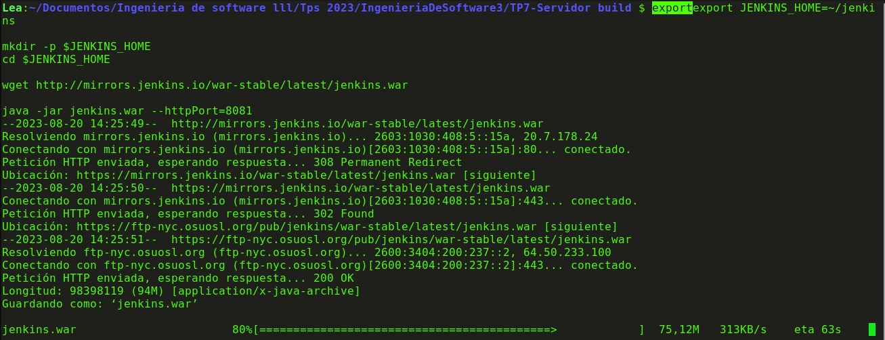

ejecutamos el contenedor de jenkins
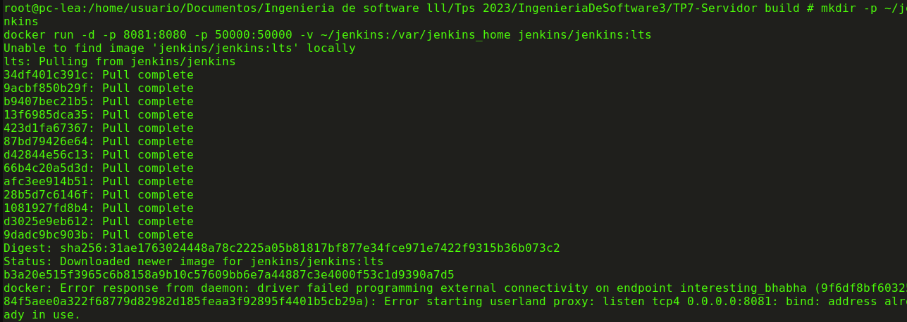

y ahora en nuestro localhost en puerto 8081 podemos ver la siguiente interfaz grafica de jenkins
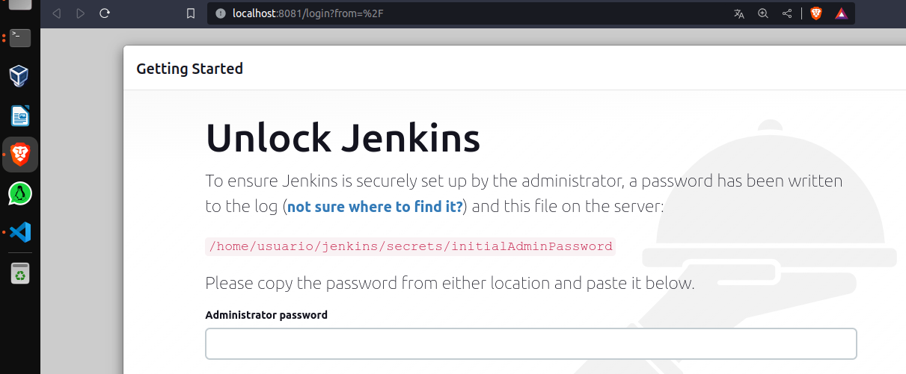

ahora nos pide la contrasenia, la cual podemos ver con el siguiente comando
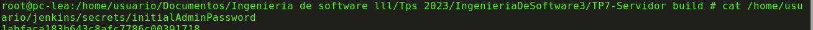

y finalmente tener acceso a jenkins, en el cual instalamos los plugins por defecto
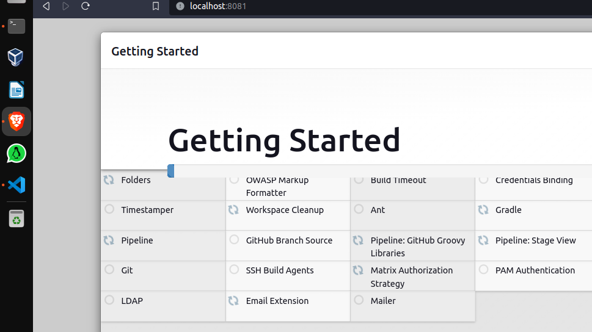

y creamos nuestro usuario
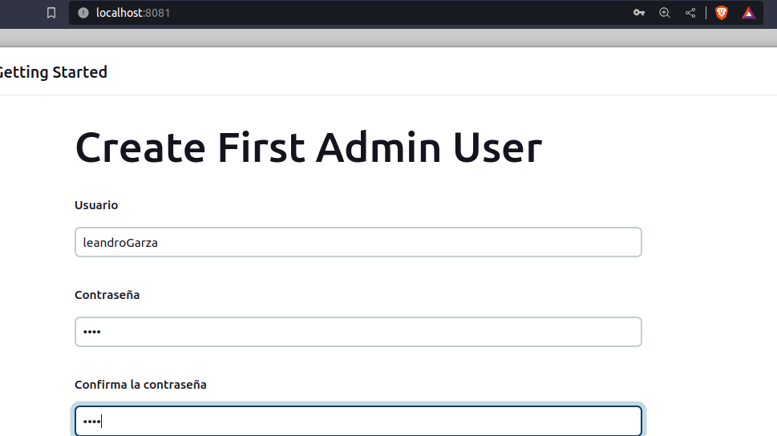

## 2- Conceptos generales

Componentes en la Página Principal de Jenkins:

    Menú de Navegación Principal: Suele ubicarse en la parte superior y contiene enlaces a las diferentes secciones y funcionalidades de Jenkins, como "Dashboard" (tablero), "Job" (trabajo), "Pipeline" (tubería), "Build History" (historial de construcción), "Manage Jenkins" (administrar Jenkins) y más.

    Build Queue (Cola de Construcción): Si hay trabajos en espera para ser ejecutados, se mostrarán en la cola de construcción. Aquí puedes ver los trabajos que se están ejecutando actualmente y su progreso.

    Lista de Trabajos Recientes: En el dashboard principal, se muestra una lista de los trabajos más recientes que han sido ejecutados, junto con sus estados y resultados.

    Build Monitor: Un resumen visual de los trabajos en ejecución y su estado actual. Esto te brinda una vista rápida de los trabajos que están siendo procesados y sus resultados.

Opciones de Administración de Jenkins:

Manage Jenkins (Administrar Jenkins): Esta sección es donde se lleva a cabo la configuración general y la administración de Jenkins. Aquí puedes gestionar plugins, configurar herramientas, ajustar configuraciones de seguridad, ver el estado del sistema y más.

Configure System (Configurar Sistema): En esta sección, puedes establecer las configuraciones globales de Jenkins, como la ubicación de ejecutables, las notificaciones por correo electrónico, el número de ejecutores, los registros de construcción y más.

Manage Plugins (Administrar Plugins): Aquí puedes instalar, actualizar y desinstalar plugins de Jenkins. Los plugins proporcionan funcionalidades adicionales para Jenkins, como integración con sistemas de control de versiones, herramientas de compilación y notificaciones.

Manage Nodes and Clouds (Administrar Nodos y Nubes): Esta opción te permite administrar los nodos (agentes) en los que se ejecutan los trabajos. Puedes agregar, eliminar y configurar nodos, así como definir configuraciones de nube para escalar automáticamente la capacidad de construcción según la demanda.

Security (Seguridad): Aquí puedes establecer la seguridad y los permisos para Jenkins. Puedes configurar usuarios, roles, grupos y políticas de seguridad para controlar el acceso y las acciones permitidas en Jenkins.

System Information (Información del Sistema): Muestra detalles sobre la configuración del sistema Jenkins, como la versión de Java, la versión de Jenkins, la ruta del sistema, etc.

Script Console (Consola de Scripts): Proporciona una consola en la que puedes ejecutar scripts Groovy para realizar tareas administrativas y configurar Jenkins.

Global Tool Configuration (Configuración Global de Herramientas): Permite configurar herramientas como JDK, Git, Maven, etc., que se pueden utilizar en trabajos de Jenkins.

## 3- Instalando Plugins y configurando herramientas

instalamos el docker pipeline
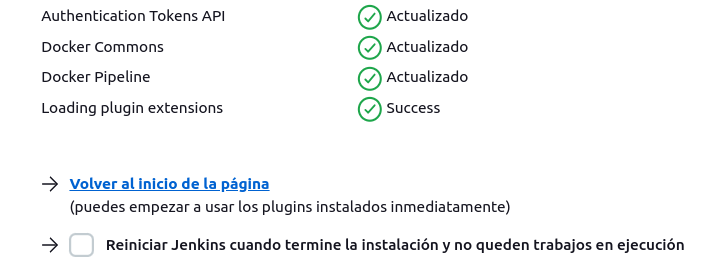

en administrar plugins vemos algunos disponibles como de JS, git, SSH, HTML, etc
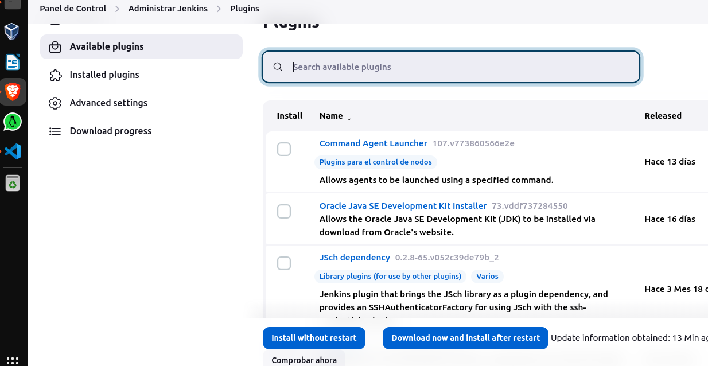

finalmente agregamos maven con el nombre M3
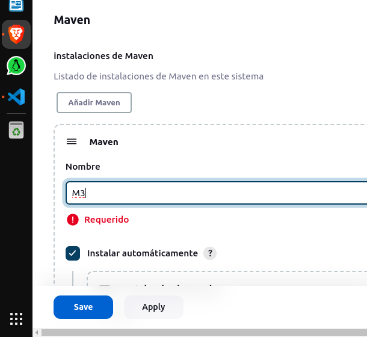

## 4- Creando el primer Pipeline Job

una vez que creamos el pipeline con nombre hello-world, vemos que el menu nos aparece de la siguiente
manera:
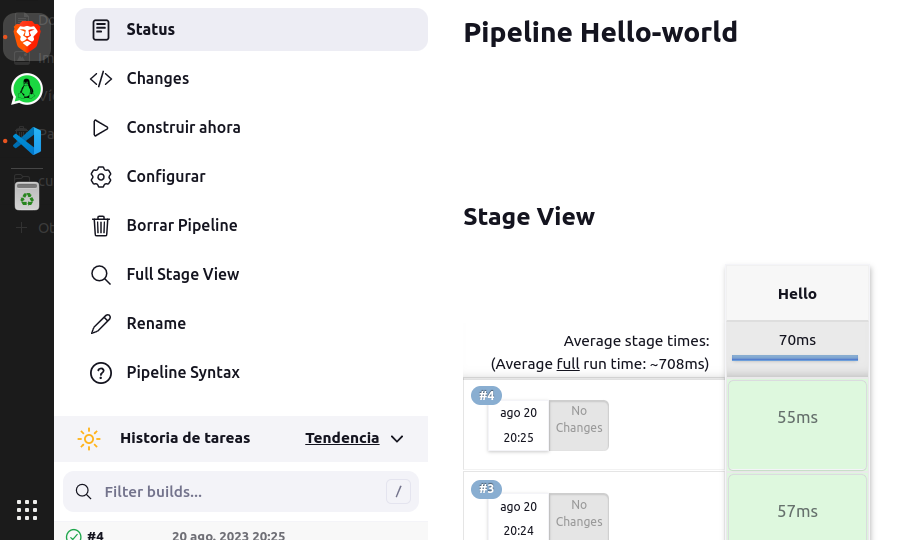

y si accedemos a cualquiera de estos build, podemos ver el output de consola el cual es un hello world
con finished: success
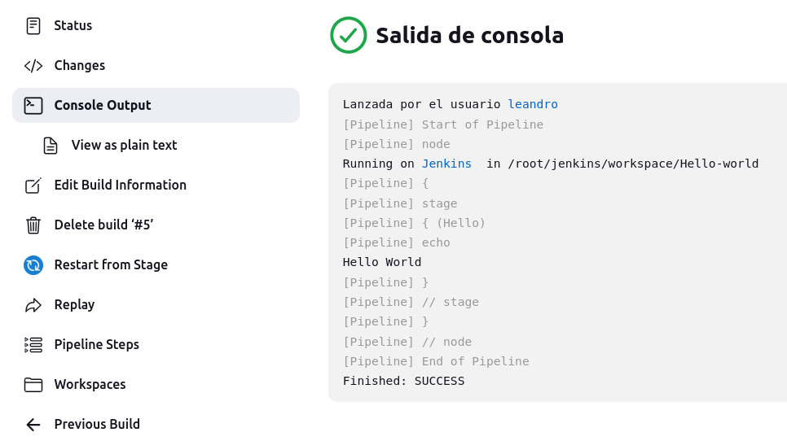

## 5- Creando un Pipeline Job con Git y Maven

una vez que creamos el item de nombre simple-maven y elegimos github + maven y le damos a construir, podemos ver la siguiente salida
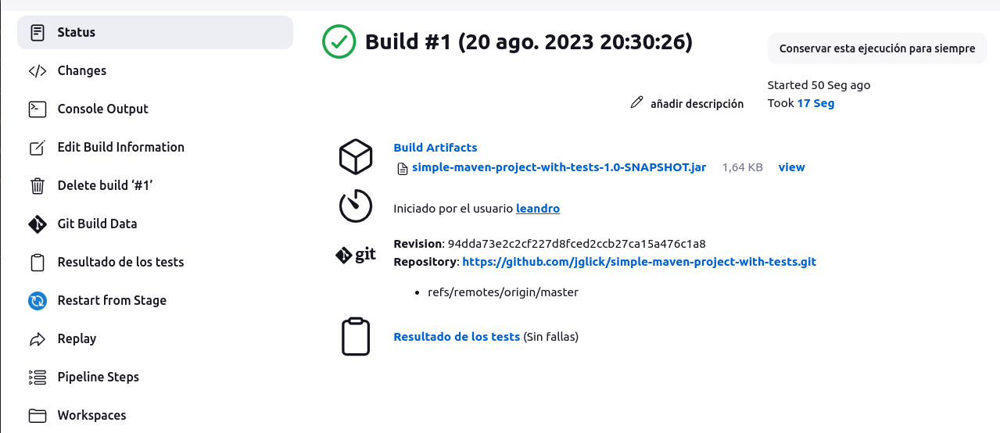

y la salida de consola es mucho mas larga a diferencia del anterior, el cual se hacia en cuestion de mili segundos. En este caso tuvimos que esperar unos cuantos segundos para la realizacion de todas las tareas. Esto se debe a que creamos un flujo de trabajo automatizado que integra un repositorio de Git con un proyecto de Maven

## 6- Utilizando nuestros proyectos

una vez que creamos otro job, y lo configuramos bien, lo mas importante es poner la url donde se encuentra nuestro spring-boot en github como se muestra a continuacion
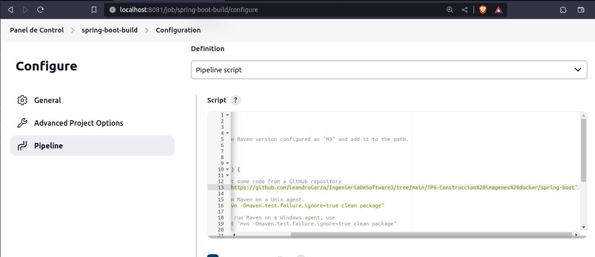

luego de guardar esto, ponemos build now y esperamos. Lo que obtenemos es lo siguiente 

