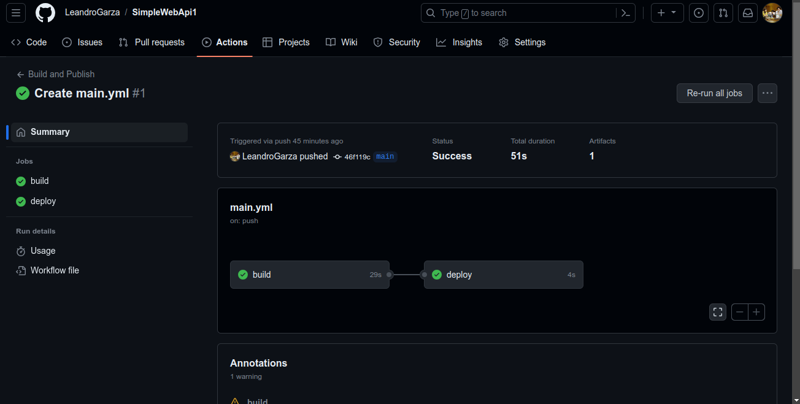
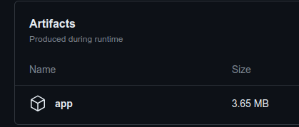
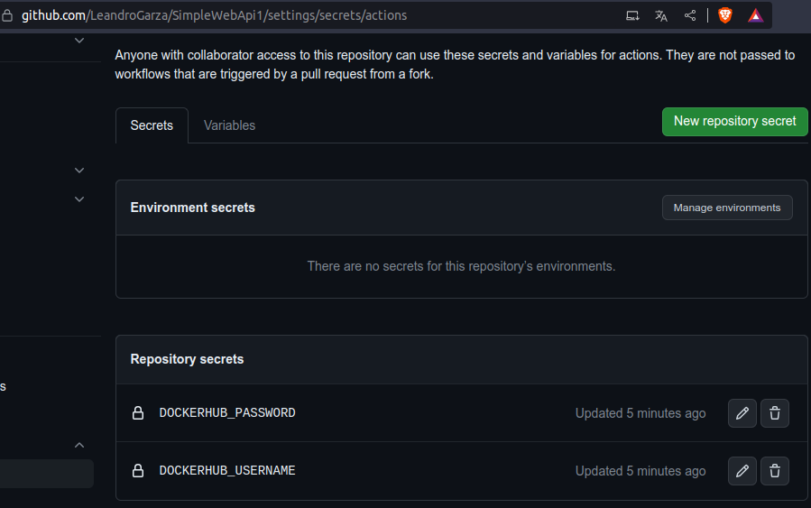
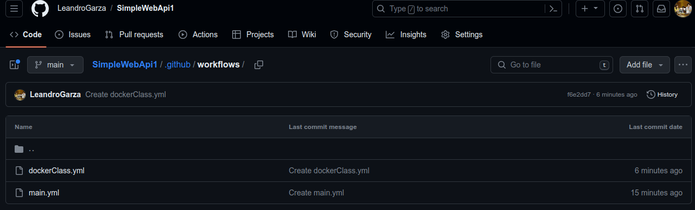
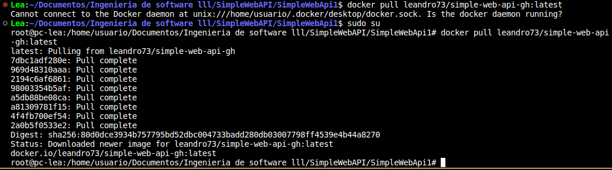
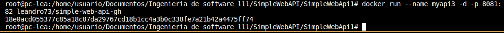
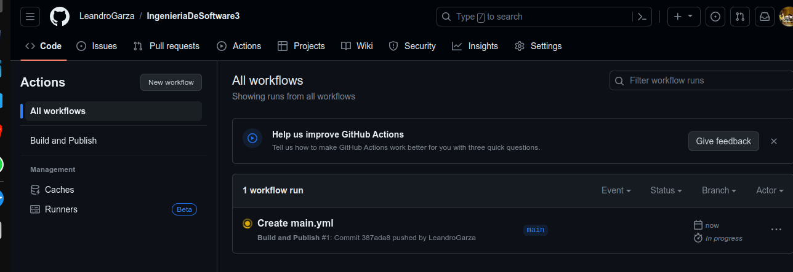
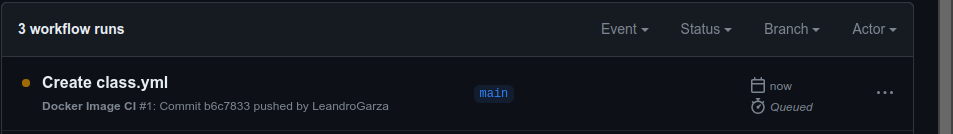

Desarrollo del TP8

## 1- Pros y Contras

GitHub Actions:
    Pros:

    Integración nativa: Integra perfectamente con repositorios de GitHub.
    Amplia gama de acciones predefinidas: Ofrece una amplia variedad de acciones preconfiguradas que permiten automatizar flujos de trabajo comunes.
    Escalabilidad: Puede manejar proyectos pequeños y grandes con facilidad.
    Acceso a recursos de GitHub: Puedes aprovechar el acceso a los recursos del ecosistema de GitHub.
    Personalización: Permite la creación de acciones personalizadas.

    Contras:

    Para tener repos privados tenes que pagar.

    Curva de aprendizaje: Puede ser complejo de configurar y entender inicialmente.
    Limitaciones en tiempo de ejecución: Algunas tareas pueden estar limitadas en tiempo de ejecución.
    Almacenamiento de artefactos: Puede tener restricciones en el almacenamiento de artefactos generados durante la construcción.

CircleCI:
    Pros:

    Configuración flexible: Permite la personalización de flujos de trabajo con una configuración basada en YAML.
    Paralelismo: Soporta ejecución paralela para acelerar la construcción.
    Amplia integración: Puede integrarse con múltiples servicios y proveedores de nube.
    Capacidad de escalado: Puede manejar proyectos de diferentes tamaños y cargas de trabajo.
    Orbs: Ofrece "orbs" predefinidos para facilitar la configuración y reutilización de flujos de trabajo.

    Contras:

    Costo: Puede volverse costoso para proyectos más grandes debido a la facturación basada en uso.
    Documentación compleja: La documentación puede ser extensa y compleja de entender para los principiantes.
    Interfaz de usuario: La interfaz de usuario podría mejorar en términos de usabilidad.

Travis CI:
    Pros:

    Integración con GitHub: Integración nativa con repositorios de GitHub.
    Fácil configuración: Configuración inicial sencilla para proyectos básicos.
    Distribución de tareas: Puede distribuir trabajos en diferentes sistemas operativos y entornos.
    
    Contras:

    Limitaciones en la versión gratuita: La versión gratuita puede tener limitaciones en términos de recursos y tiempo de ejecución.
    Menos personalización: Puede ser menos flexible en comparación con otras herramientas en términos de personalización de flujos de trabajo.
    Escalabilidad limitada: Puede tener dificultades en proyectos más grandes y complejos.

Codefresh:
    Pros:

    Configuración simple: Interfaz intuitiva y fácil configuración de flujos de trabajo.
    Soporte de Kubernetes: Se enfoca en la integración con Kubernetes y aplicaciones en contenedores.
    Automatización completa del ciclo de vida: Cubre todo el ciclo de vida de desarrollo, desde la construcción hasta la implementación.
    Gestión de recursos: Permite administrar recursos de manera eficiente.
    
    Contras:

    Especialización en Kubernetes: Puede ser menos adecuado si no estás utilizando Kubernetes.
    Menos opciones de integración: Puede tener menos integraciones y opciones en comparación con otras herramientas.

GitLab CI/CD:
    Pros:

    Integración completa: Parte de la suite de herramientas de GitLab, lo que permite una integración completa con el flujo de trabajo de desarrollo.
    Configuración en el repositorio: La configuración de CI/CD se realiza a través de archivos en el repositorio.
    Gestión de artefactos y despliegue: Ofrece funcionalidades completas para gestionar artefactos y automatizar despliegues.

    Contras:

    Complejidad para proyectos pequeños: Puede sentirse abrumador para proyectos pequeños con necesidades simples.
    Requiere GitLab: Está más optimizado para proyectos alojados en GitLab.
    Curva de aprendizaje: Puede tener una curva de aprendizaje más pronunciada para usuarios nuevos.

----------------------------------------------------------------------------------------
concluciones: 
Integración y Ecosistema:

GitHub Actions se integra bien con GitHub y ofrece muchas acciones predefinidas.
CircleCI y Travis CI son flexibles pero pueden ser costosos para proyectos grandes.
Codefresh se especializa en Kubernetes.
GitLab CI/CD es ideal para proyectos en GitLab.
Complejidad y Curva de Aprendizaje:

GitHub Actions y GitLab CI/CD pueden ser más complejas al inicio.
CircleCI y Travis CI son más simples para proyectos pequeños.
Personalización y Flexibilidad:

GitHub Actions, CircleCI y GitLab CI/CD son flexibles.
Codefresh se centra en contenedores y Kubernetes.
Escalabilidad y Recursos:

GitHub Actions y CircleCI escalan bien.
Travis CI y GitLab CI/CD podrían tener límites en proyectos grandes.
Integraciones y Soporte:

Todas tienen integraciones, con ventajas en GitHub Actions y GitLab CI/CD.
Costo y Facturación:

CircleCI y Travis CI pueden ser costosos.
Algunas herramientas limitan la versión gratuita.

## 2- Configurando GitHub Actions

adjunto repositorio del simpleWebAPi: https://github.com/LeandroGarza/SimpleWebApi1.git

## 3- Utilizando nuestros proyectos con Docker

Paso 1: Configurar las credenciales de Docker Hub en tu repositorio de GitHub:

Paso 2: Crear un workflow para construir y subir la imagen de Docker:

Paso 3: Verificar en DockerHub que la imagen ha sido subida

Paso 4: Descargar la imagen

Paso 5: Crear el contenedor

finalmente vamos al navegador al puerto 8081 ya que el 8080 lo tenia ocupado, y podemos ver la salida
en pantalla.

## 4- Crear una GitHub Action que genere los artefactos para el proyecto React

luego esperamos que se descargue y aparecera en dockerhub. POsteriormente podemos tirarle en pull
para traerlo desde el dockerhub