Desarrollo del TP9

## 5.1- Preparamos el entorno

lo primero es instalar visual studio code, el cual ya lo tengo instalado y es donde desarrollo estos tp
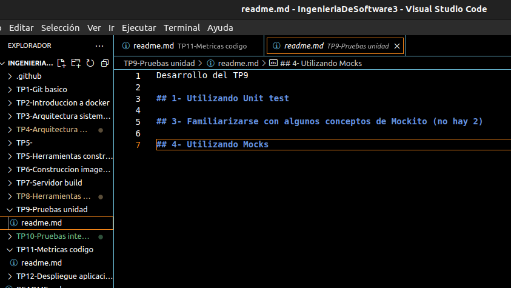

luego creamos un nuevo proyecto de pruebas unitarias con Nunit, el cual podemos ver en esta misma carpeta del readme.
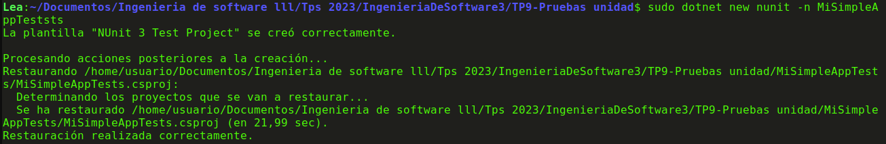

luego agregamos los paquetes
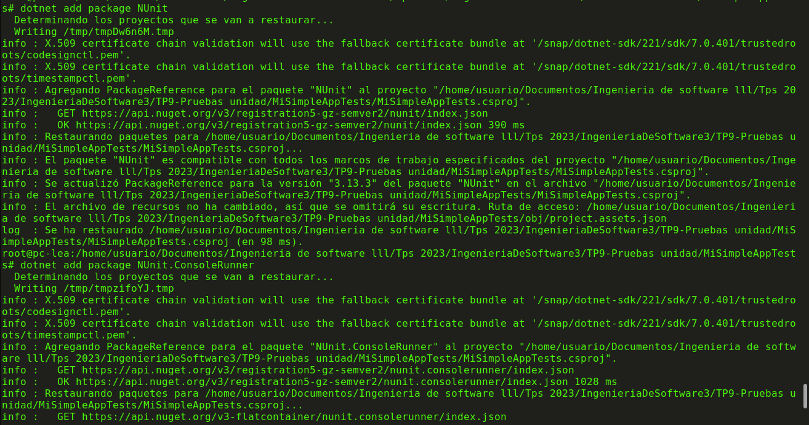

agregamos la referencia a la otra carpeta
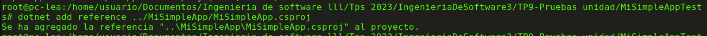

instalamos la extension net core test explorer
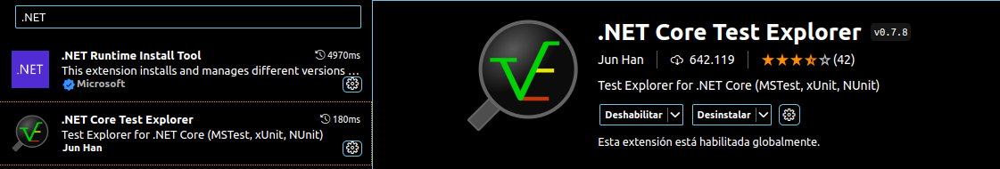

finalmente, una vez que hacemos click en el icono de prueba, ponemos el comando dotnet test para ver los resultados y sale lo siguiente:
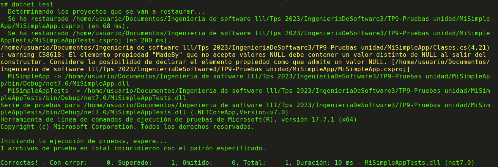

luego revisamos los archivos clases.cs y program.cs y tienen distintas referencias

luego modificamos el archivo de mysimpleapptest y ejecutamos el comando dotnet test
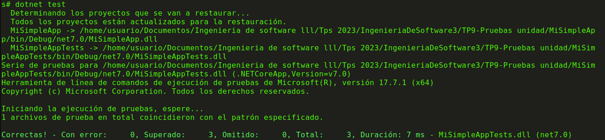

lo siguiente es modificar el codigo de clases.cs para que devuela false en lugar de true. Hacemos la prueba y obtenemos lo siguiente
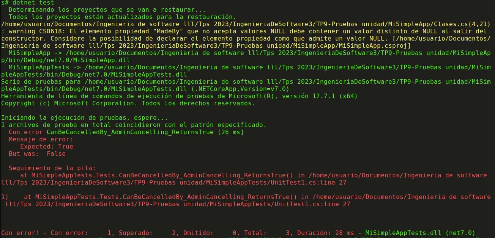

finalmente, volvemos a modificar el codigo para que quede de la siguiente forma:
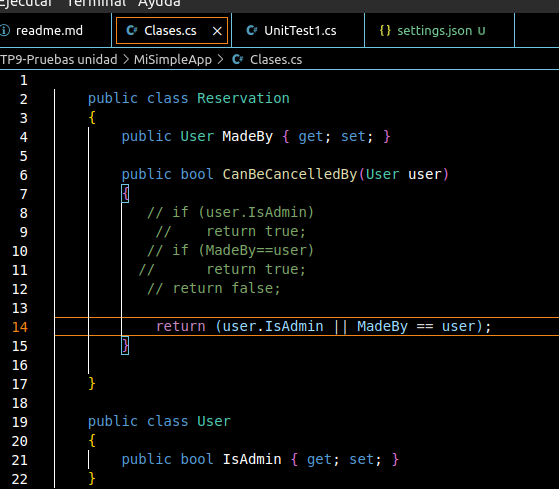

para lo cual obtenemos lo siguiente
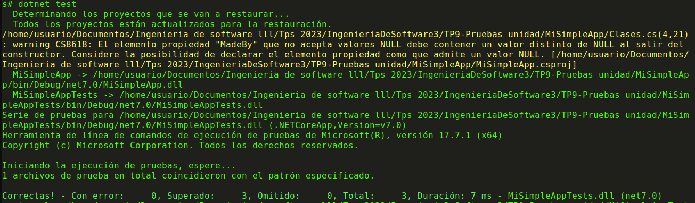

## 6.1 - Desarrollo de pruebas unitarias sobre una webAPi

una vez clonado el repo y creado el simpleWebApitest
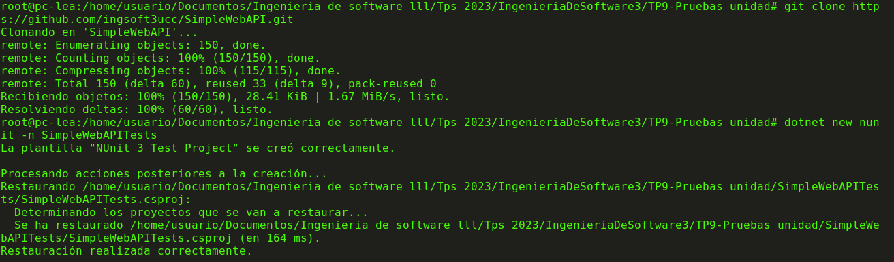

agregamos la referencia
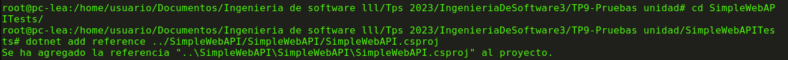

y modificamos el codigo del settings.json asi como el del UnitTest1.cs y ejecutamos la prueba
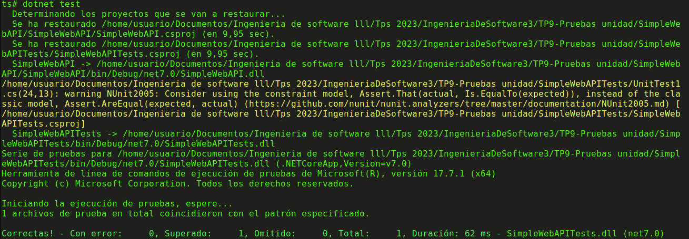

##  7  Familiarizarse con conceptos de Moq

##  8  Utilizando moq

una vez que clonamos el repo, ejecutamos la aplicacion. Para esto primero tiramos el comando dotnet build el cual no devuelve errores
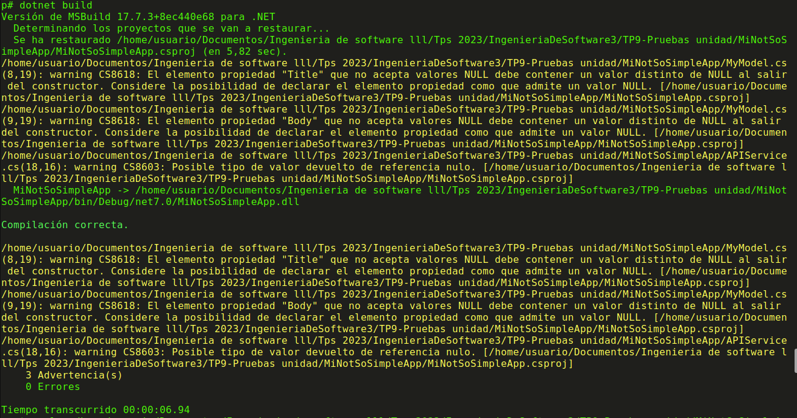

y finalmente tiramos el run, el cual devuelve 100 items desde la api.
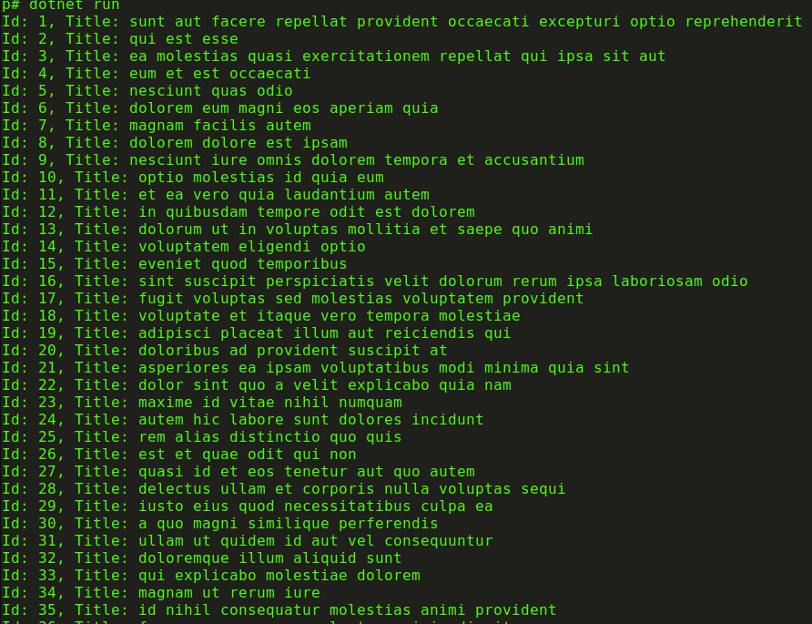

el servicio externo sera una api que implementa el metodo getMyModelAsync que implementa la interfaza y apli service lo que hace es ir y consultar directamente una api via get que nos devuelve los 100 items.
Llenamos la variable myMOdels con los datos que tiene cada uno de los post. Luego se itera en myModels para ir poniendolos por consola.
Si en lugar de consultar a una api consultaramos a una BD, en lugar de la url consultariamos a oracle por ejemplo. 

para crear el proyecto de Nunit vamos un directorio atras para crear el MiNotsossimpleapptest con los siguientes comandos
cd ..

dotnet new nunit -n MiNotSoSimpleAppTests
cd MiNotSoSimpleAppTests
dotnet add reference ../MiNotSoSimpleApp/MiNotSoSimpleApp.csproj
dotnet add package NUnit
dotnet add package Moq
dotnet add package NUnit3TestAdapter
dotnet add package Microsoft.Extensions.Http
dotnet add package Microsoft.Extensions.DependencyInjection
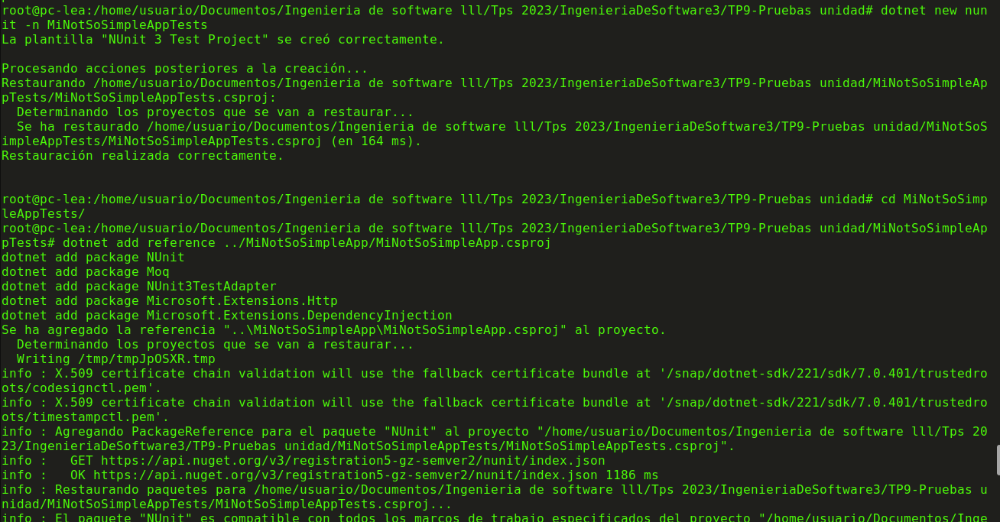

finalmente en prueba, cambiamos el settings.json y ejecutamos el test. Finalmente ejecutamos el comando dotnet test en consola y vemos el siguiente resultado:
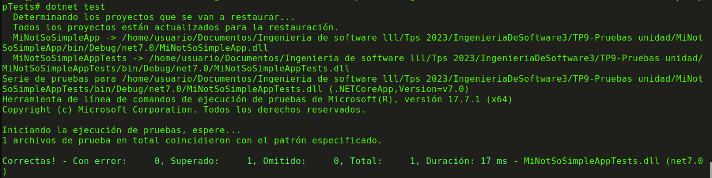

## 8.2 escribimos test

ahora cambiamos el codigo de unitTest1.cs y lo corremos desde pruebas, y ejecutamos dotnet test
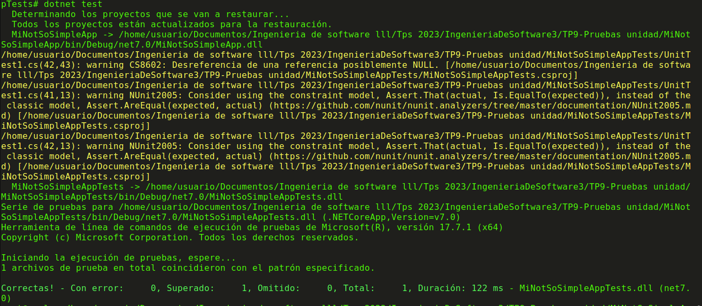

## 8.3 explica codigo

el codigo crea un mock response, y en el content crea un json que tiene la misma estructura que tiene la api real que usamos antes pero a diferencia de la API le ponemos los valores en duro que yo quiero.
Creamos un servicio IApiService que ya no es real, sino que es un nuevo objeto mock que devuelve el contenido. FInalmente verificamos que no sea nulo, que devuelva 1, y que tenga el titulo "test title"

Osea hicimos una prueba unitaria cambiando la implementacion de la interfaz para que se ajuste a lo qeu probamos. 

## 8.5 hacerlo fallar, arreglarlo y volverlo a correr.

para hacerlo fallar lo que hacemos es cambiarle para que espere test title2 y no test title, por lo tanto vemos el siguiente error
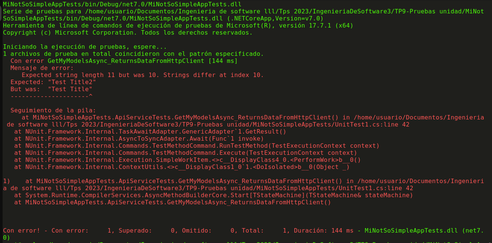

el codigo que modificamos es el siguiente
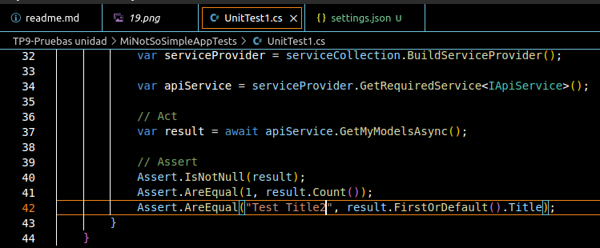

finalmente lo arreglamos, y volvemos a ejecutar (vemos que la primera linea es del error anterior y posteriormente tiramos el comando dotnet test)
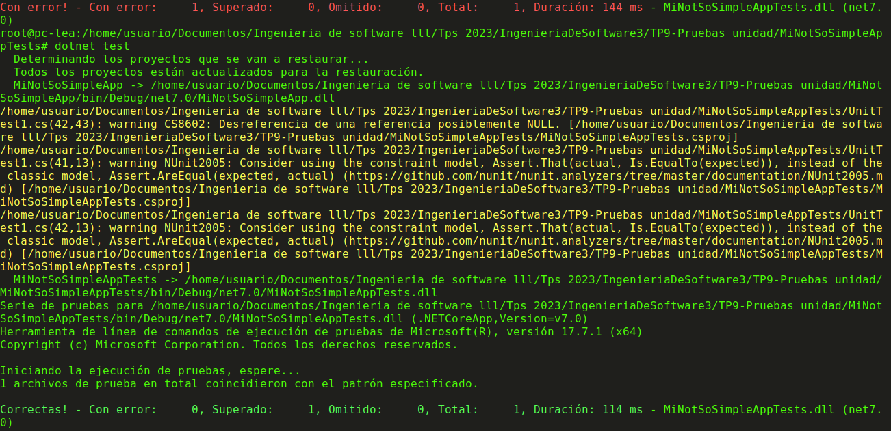

## 8.6 MOdificar el mock

lo que hice para que devuelva mas elementos es modificar la linea de codigo para que en lugar de 1 agarre 5 de la siguiente manera

 Content = new StringContent("[{ \"UserId\": 1, \"Id\": 1, \"Title\": \"Test Title 1\", \"Body\": \"Test Body 1\" },{ \"UserId\": 2, \"Id\": 2, \"Title\": \"Test Title 2\", \"Body\": \"Test Body 2\" },{ \"UserId\": 3, \"Id\": 3, \"Title\": \"Test Title 3\", \"Body\": \"Test Body 3\" },{ \"UserId\": 4, \"Id\": 4, \"Title\": \"Test Title 4\", \"Body\": \"Test Body 4\" },{ \"UserId\": 5, \"Id\": 5, \"Title\": \"Test Title 5\", \"Body\": \"Test Body 5\" }]")

## 9 Capturar los unit test como parte del proceso CI/CD

una vez que subimos todo a github, podemos subirlo a docker hub mediante actions como hicimos la clase pasada.

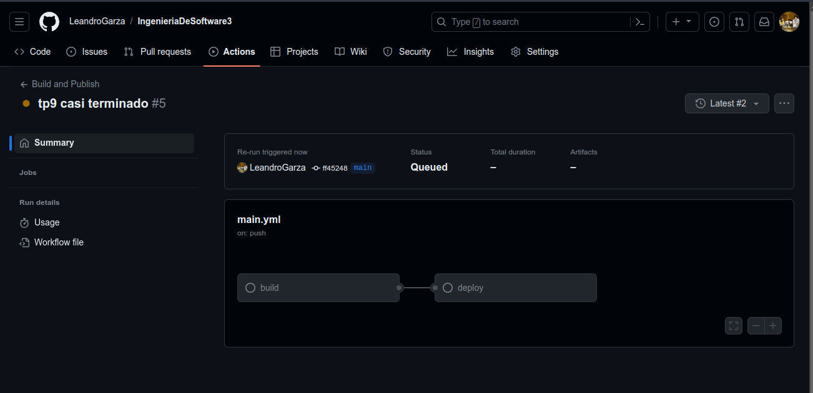

nos aparece en docker hub, y una vez que sucede esto, desde consola podemos tirar un pull para que nos aparezca de manera local.